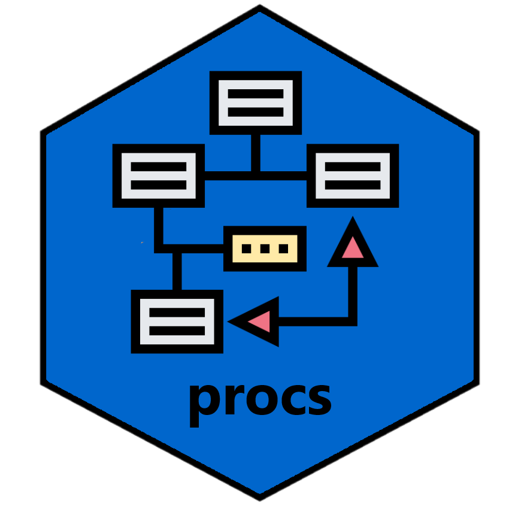

<!-- badges: start -->

<!---->

<!-- badges: end -->

# Introduction to **procs**
<!-- -->

R provides a wide range of statistical packages and functions.  However,
these statistical functions frequently return a fragmented output.  The user
is often left to compile R statistical results into a readable report themselves.

SAS software, on the other hand, provides the same statistical results, 
but with rich outputs.  These outputs include multiple datasets
and complete statistical reports.  

The purpose of the **procs** package is to recreate some SAS statistical
procedures in R.  The first version of the package will attempt to recreate
SAS 'proc freq'.  Subsequent versions of the package will add additional,
commonly used procedures like 'proc means' and 'proc tabulate'.

### Installation

The easiest way to install the **procs** package is to run the following 
command from your R console:

    install.packages("procs")

Then put the following line at the top of your script:

    library(procs)
    
For examples and usage 
information, please visit the **procs** documentation site 
[here](https://procs.r-sassy.org/articles/procs.html)

### Getting Help

If you need help, the first place 
to turn to is the [procs](https://procs.r-sassy.org) web site.  

If you want to look at the code for the **procs** package, visit the
github page [here](https://github.com/dbosak01/procs).

If you encounter a bug or have a feature request, please submit an issue 
[here](https://github.com/dbosak01/procs/issues).

### See Also

The **procs** package is part of the **sassy** meta-package. 
The **sassy** meta-package includes several packages that help make R
easier for SAS® programmers.  You can read more about the **sassy** package
[here](https://sassy.r-sassy.org).
