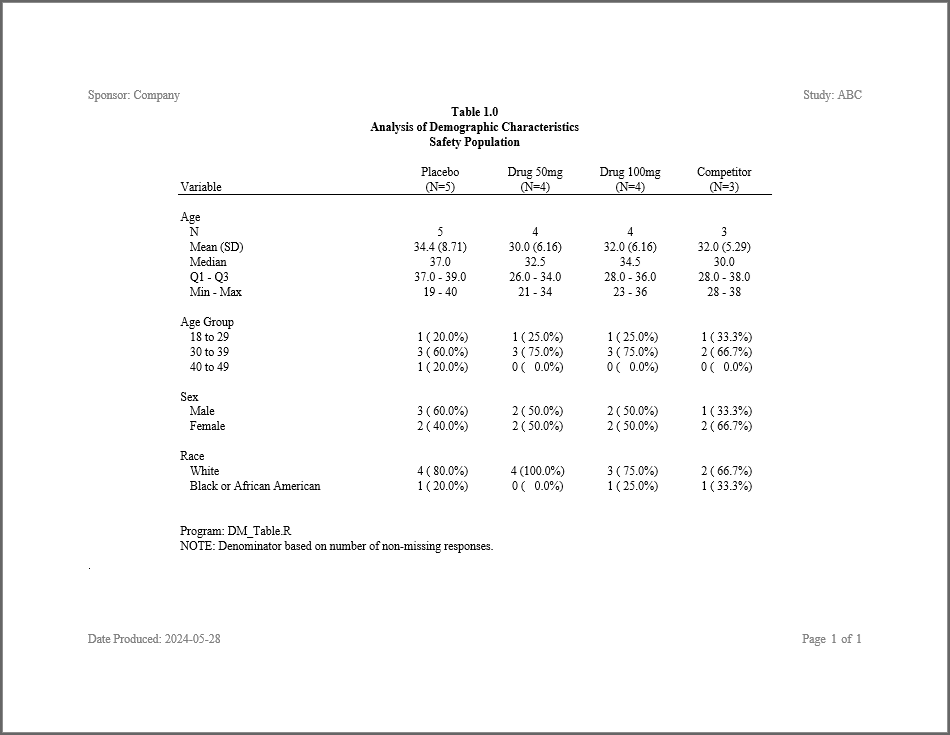

```{r setup, include = FALSE}
knitr::opts_chunk$set(
  collapse = TRUE,
  comment = "#>"
)

```
## Program

The following example shows a complete program.  The example illustrates
how **procs** functions work together, and interact with other
**sassy** functions to create a demographics table with p-value statistics.

```{r eval=FALSE, echo=TRUE}
library(sassy)
library(procs)

# Prepare Log -------------------------------------------------------------


options("logr.autolog" = TRUE,
        "logr.on" = TRUE,
        "logr.notes" = FALSE,
        "procs.print" = FALSE)

tmp <- tempdir()

# Open log
lf <- log_open(file.path(tmp, "example1.log"))


# Prepare formats ---------------------------------------------------------

sep("Prepare formats")

put("Age categories")
agecat <- value(condition(x >= 18 & x <= 29, "18 to 29"),
                condition(x >=30 & x <= 39, "30 to 39"),
                condition(x >=40 & x <=49, "40 to 49"),
                condition(x >= 50, ">= 50"),
                condition(TRUE, "Out of range")) 

put("Sex decodes")
fmt_sex <- value(condition(is.na(x), "Missing"),
                 condition(x == "M", "Male"),
                 condition(x == "F", "Female"),
                 condition(TRUE, "Other"))

put("Race decodes")
fmt_race <- value(condition(is.na(x), "Missing"),
                  condition(x == "WHITE", "White"),
                  condition(x == "BLACK", "Black or African American"),
                  condition(TRUE, "Other"))


put("Compile format catalog")
fc <- fcat(MEAN = "%.1f", STD = "(%.2f)", 
           Q1 = "%.1f", Q3 = "%.1f",
           MIN = "%d", MAX = "%d", 
           CNT = "%2d", PCT = "(%5.1f%%)",
           AGECAT = agecat,
           SEX = fmt_sex,
           RACE = fmt_race,
           AOV.F = "%5.3f",
           AOV.P = "(%5.3f)",
           CHISQ = "%5.3f",
           CHISQ.P = "(%5.3f)")


# Load and Prepare Data ---------------------------------------------------

sep("Prepare Data")


put("Create sample ADSL data.")
adsl <- read.table(header = TRUE, text = '
  SUBJID  ARM    SEX  RACE    AGE
  "001"   "ARM A" "F"  "WHITE" 19 
  "002"   "ARM B" "F"  "WHITE" 21 
  "003"   "ARM C" "F"  "WHITE" 23 
  "004"   "ARM D" "F"  "BLACK" 28 
  "005"   "ARM A" "M"  "WHITE" 37  
  "006"   "ARM B" "M"  "WHITE" 34 
  "007"   "ARM C" "M"  "WHITE" 36  
  "008"   "ARM D" "M"  "WHITE" 30   
  "009"   "ARM A" "F"  "WHITE" 39  
  "010"   "ARM B" "F"  "WHITE" 31  
  "011"   "ARM C" "F"  "BLACK" 33 
  "012"   "ARM D" "F"  "WHITE" 38 
  "013"   "ARM A" "M"  "BLACK" 37 
  "014"   "ARM B" "M"  "WHITE" 34  
  "015"   "ARM C" "M"  "WHITE" 36
  "016"   "ARM A" "M"  "WHITE" 40')  

put("Categorize AGE")
adsl$AGECAT <- fapply(adsl$AGE, agecat) |> put()


put("Get ARM population counts")
arm_pop <- 
  proc_freq(adsl, tables = ARM, 
            options = v(nopercent, nonobs, long)) 

# Age Summary Block -------------------------------------------------------

sep("Create summary statistics for age")

put("Call means procedure to get summary statistics for age")
age_stats <- 
  proc_means(adsl, var = AGE,
             stats = v(n, mean, std, median, q1, q3, min, max),
             by = ARM, 
             options = v(notype, nofreq)) 

put("Combine stats")
age_comb <- 
  datastep(age_stats, 
           format = fc,
           drop = find.names(age_stats, start = 4), 
           {
              `Mean (SD)` <- fapply2(MEAN, STD)
              Median <- MEDIAN
              `Q1 - Q3` <- fapply2(Q1, Q3, sep = " - ")
              `Min - Max` <- fapply2(MIN, MAX, sep = " - ")
           }) 

put("Transpose ARMs into columns")
age_trans <- 
  proc_transpose(age_comb, 
                 var = names(age_comb),
                 copy = VAR, id = BY, 
                 name = LABEL) 

put("Calculate aov")
age_aov <- aov(AGE ~ ARM, data = adsl) |> 
  summary()

put("Get aov into proper data frame") 
age_aov <- age_aov[[1]][1, c("F value", "Pr(>F)")]
names(age_aov) <- c("AOV.F", "AOV.P")
age_aov <- as.data.frame(age_aov) |> put()

put("Combine aov statistics")
age_aov_comb <- 
  datastep(age_aov, 
           keep = "PVALUE",
           format = fc,
           {
             PVALUE <- fapply2(AOV.F, AOV.P)
             
           }) 

put("Append aov")
age_block <- cbind(age_trans, age_aov_comb) |> put()

# Sex Block ---------------------------------------------------------------

sep("Create frequency counts for SEX")

put("Get sex frequency counts")
sex_freq <- 
  proc_freq(adsl, tables = SEX,
            by = ARM,
            options = nonobs) 


put("Combine counts and percents.")
sex_comb <- 
  datastep(sex_freq, 
           format = fc, 
           rename = list(CAT = "LABEL"),
           drop = v(CNT, PCT), 
           {
             
             CNTPCT <- fapply2(CNT, PCT)
             
           }) 

put("Transpose ARMs into columns")
sex_trans <- 
  proc_transpose(sex_comb, id = BY, var = CNTPCT,
                 copy = VAR, by = LABEL) 

put("Clean up")
sex_cnts <- 
  datastep(sex_trans, drop = "NAME", 
           {
            
             LABEL <- fapply(LABEL, fc$SEX)
             LABEL <- factor(LABEL, levels = levels(fc$SEX))

           }) 

put("Sort by label")
sex_cnts <- proc_sort(sex_cnts, by = LABEL) 

put("Get sex chisq")
sex_chisq <- proc_freq(adsl, tables = v(SEX * ARM),
                       options = v(chisq, notable)) 

put("Combine chisq statistics")
sex_chisq_comb <- 
  datastep(sex_chisq,
           format = fc,
           keep = c("PVALUE"), 
           {
             
             PVALUE = fapply2(CHISQ, CHISQ.P)
           }) 

put("Append chisq")
sex_block <- cbind(sex_cnts, sex_chisq_comb) |> put()
                


# Race block --------------------------------------------------------------


sep("Create frequency counts for RACE")

put("Get race frequency counts")
race_freq <- 
  proc_freq(adsl, tables = RACE,
            by = ARM,
            options = nonobs) 


put("Combine counts and percents.")
race_comb <- 
  datastep(race_freq, 
           format = fc, 
           rename = list(CAT = "LABEL"),
           drop = v(CNT, PCT), 
           {
             
             CNTPCT <- fapply2(CNT, PCT)
             
           }) 

put("Transpose ARMs into columns")
race_trans <- 
  proc_transpose(race_comb, id = BY, var = CNTPCT,
                 copy = VAR, by = LABEL) 

put("Clean up")
race_cnts <- 
  datastep(race_trans, drop = v(NAME),
           where = expression(del == FALSE),
           {
             
             LABEL <- fapply(LABEL, fc$RACE)
             LABEL <- factor(LABEL, levels = levels(fc$RACE))
          
           }) 

put("Sort by label")
race_cnts <- proc_sort(race_cnts, by = LABEL)

put("Get race chisq")
race_chisq <- 
  proc_freq(adsl, tables = RACE * ARM,
            options = v(chisq, notable)) 

put("Combine chisq statistics")
race_chisq_comb <- 
  datastep(race_chisq,
           format = fc,
           keep = c("PVALUE"), 
           {
             
             PVALUE = fapply2(CHISQ, CHISQ.P)
           }) 

put("Append chisq")
race_block <- cbind(race_cnts, race_chisq_comb) |> put()


# Age Group Block ----------------------------------------------------------

sep("Create frequency counts for Age Group")


put("Get age group frequency counts")
ageg_freq <- 
  proc_freq(adsl,
            table = AGECAT,
            by = ARM,
            options = nonobs) 

put("Combine counts and percents and assign age group factor for sorting")
ageg_comb <- 
  datastep(ageg_freq,
           format = fc,
           keep = v(VAR, LABEL, BY, CNTPCT),
           {
             CNTPCT <- fapply2(CNT, PCT)
             LABEL <- factor(CAT, levels = levels(fc$AGECAT))
           }) 


put("Sort by age group factor")
ageg_sort <- proc_sort(ageg_comb, by = v(BY, LABEL)) 

put("Tranpose age group block")
ageg_trans <- 
  proc_transpose(ageg_sort,
                 var = CNTPCT,
                 copy = VAR,
                 id = BY,
                 by = LABEL) 

put("Some clean up")
ageg_cnts <- 
  datastep(ageg_trans,
           drop = "NAME",
           {}) 

put("Get ageg chisq")
ageg_chisq <- 
  proc_freq(adsl, tables = v(AGECAT * ARM),
            options = v(chisq, notable)) 

put("Combine chisq statistics")
ageg_chisq_comb <- 
  datastep(ageg_chisq,
           format = fc,
           keep = c("PVALUE"), 
           {
             PVALUE = fapply2(CHISQ, CHISQ.P)
           }) 

put("Append chisq")
ageg_block <- cbind(ageg_cnts, ageg_chisq_comb) |> put()


put("Combine blocks into final data frame")
final <- rbind(age_block, ageg_block, sex_block, race_block) |> put()

# Report ------------------------------------------------------------------


sep("Create and print report")

var_fmt <- c("AGE" = "Age", "AGECAT" = "Age Group", "SEX" = "Sex", "RACE" = "Race")

plbl <- "Tests of Association{supsc('1')}\n Value (P-Value)"

# Create Table
tbl <- create_table(final, first_row_blank = TRUE) |>  
  column_defaults(from = `ARM A`, to = `ARM D`, align = "center", width = 1.1) |>  
  stub(vars = c("VAR", "LABEL"), "Variable", width = 2.5) |>  
  define(VAR, blank_after = TRUE, dedupe = TRUE, label = "Variable",
         format = var_fmt,label_row = TRUE) |>  
  define(LABEL, indent = .25, label = "Demographic Category") |> 
  define(`ARM A`,  label = "Placebo", n = arm_pop["ARM A"]) |>  
  define(`ARM B`,  label = "Drug 50mg", n = arm_pop["ARM B"]) |>  
  define(`ARM C`,  label = "Drug 100mg", n = arm_pop["ARM C"]) |>  
  define(`ARM D`,  label = "Competitor", n = arm_pop["ARM D"]) |>  
  define(PVALUE, label = plbl, width = 2, dedupe = TRUE, align = "center") |> 
  titles("Table 1.0", "Analysis of Demographic Characteristics", 
         "Safety Population") |> 
  footnotes("Program: DM_Table.R",
            "NOTE: Denominator based on number of non-missing responses.",
            "{supsc('1')}Pearson's Chi-Square tests will be used for "
            %p% "Categorical variables and ANOVA tests for continuous variables.") 

rpt <- create_report(file.path(tmp, "example2.rtf"), 
                     output_type = "RTF", 
                     font = "Courier") |> 
  page_header("Sponsor: Archytas", "Study: ABC") |> 
  set_margins(top = 1, bottom = 1) |>  
  add_content(tbl) |> 
  page_footer("Date Produced: {Sys.Date()}", right = "Page [pg] of [tpg]")

put("Write out the report")
res <- write_report(rpt)

# Clean Up ----------------------------------------------------------------
sep("Clean Up")


log_close()

# View log
writeLines(readLines(lf, encoding = "UTF-8"))

# View report
# file.show(res$modified_path)

# View log
# file.show(lf)

```
## Output

Here is the output:




## Log

And here is the log:
```
=========================================================================
Log Path: C:/Users/dbosa/AppData/Local/Temp/Rtmp44T45t/log/example1.log
Program Path: C:/packages/Testing/procs/DemoProcTest2.R
Working Directory: C:/packages/Testing
User Name: dbosa
R Version: 4.2.1 (2022-06-23 ucrt)
Machine: SOCRATES x86-64
Operating System: Windows 10 x64 build 19044
Base Packages: stats graphics grDevices utils datasets methods base Other
Packages: tidylog_1.0.2 procs_0.0.9005 reporter_1.3.6 libr_1.2.6 fmtr_1.5.8
logr_1.3.2 common_1.0.3 sassy_1.0.8
Log Start Time: 2022-08-19 08:05:51
=========================================================================

=========================================================================
Prepare formats
=========================================================================

Age categories

# A user-defined format: 5 conditions
  Name Type        Expression        Label Order
1  obj    U x >= 18 & x <= 29     18 to 29    NA
2  obj    U x >= 30 & x <= 39     30 to 39    NA
3  obj    U x >= 40 & x <= 49     40 to 49    NA
4  obj    U           x >= 50        >= 50    NA
5  obj    U              TRUE Out of range    NA

Sex decodes

# A user-defined format: 4 conditions
  Name Type Expression   Label Order
1  obj    U   is.na(x) Missing    NA
2  obj    U   x == "M"    Male    NA
3  obj    U   x == "F"  Female    NA
4  obj    U       TRUE   Other    NA

Race decodes

Compile format catalog

# A format catalog: 15 formats
- $MEAN: type S, "%.1f"
- $STD: type S, "(%.2f)"
- $Q1: type S, "%.1f"
- $Q3: type S, "%.1f"
- $MIN: type S, "%d"
- $MAX: type S, "%d"
- $CNT: type S, "%2d"
- $PCT: type S, "(%5.1f%%)"
- $AGECAT: type U, 5 conditions
- $SEX: type U, 4 conditions
- $RACE: type U, 4 conditions
- $AOV.F: type S, "%5.3f"
- $AOV.P: type S, "(%5.3f)"
- $CHISQ: type S, "%5.3f"
- $CHISQ.P: type S, "(%5.3f)"

=========================================================================
Prepare Data
=========================================================================

=========================================================================
Read in ADSL data
=========================================================================

Create sample ADSL data.

Categorize AGE

18 to 29
18 to 29
18 to 29
18 to 29
30 to 39
30 to 39
30 to 39
30 to 39
30 to 39
30 to 39
30 to 39
30 to 39
30 to 39
30 to 39
30 to 39
40 to 49

Get ARM population counts

proc_freq: input data set 16 rows and 6 columns
           tables: ARM
           view: TRUE
           output: 1 datasets

  VAR STAT ARM A ARM B ARM C ARM D
1 ARM  CNT     5     4     4     3

=========================================================================
Create summary statistics for age
=========================================================================

Call means procedure to get summary statistics for age

proc_means: input data set 16 rows and 6 columns
            by: ARM
            var: AGE
            stats: n mean std median q1 q3 min max
            view: TRUE
            output: 1 datasets

     BY VAR N MEAN      STD MEDIAN Q1 Q3 MIN MAX
1 ARM A AGE 5 34.4 8.706320   37.0 37 39  19  40
2 ARM B AGE 4 30.0 6.164414   32.5 26 34  21  34
3 ARM C AGE 4 32.0 6.164414   34.5 28 36  23  36
4 ARM D AGE 3 32.0 5.291503   30.0 28 38  28  38

Combine stats

datastep: columns decreased from 10 to 7

     BY VAR N   Mean (SD) Median     Q1 - Q3 Min - Max
1 ARM A AGE 5 34.4 (8.71)   37.0 37.0 - 39.0   19 - 40
2 ARM B AGE 4 30.0 (6.16)   32.5 26.0 - 34.0   21 - 34
3 ARM C AGE 4 32.0 (6.16)   34.5 28.0 - 36.0   23 - 36
4 ARM D AGE 3 32.0 (5.29)   30.0 28.0 - 38.0   28 - 38

Transpose ARMs into columns

proc_transpose: input data set 4 rows and 7 columns
                var: BY VAR N Mean (SD) Median Q1 - Q3 Min - Max
                id: BY
                copy: VAR
                name: LABEL
                output dataset 5 rows and 6 columns

  VAR     LABEL       ARM A       ARM B       ARM C       ARM D
1 AGE         N           5           4           4           3
2 AGE Mean (SD) 34.4 (8.71) 30.0 (6.16) 32.0 (6.16) 32.0 (5.29)
3 AGE    Median        37.0        32.5        34.5        30.0
4 AGE   Q1 - Q3 37.0 - 39.0 26.0 - 34.0 28.0 - 36.0 28.0 - 38.0
5 AGE Min - Max     19 - 40     21 - 34     23 - 36     28 - 38

Calculate aov

Get aov into proper data frame

                AOV.F     AOV.P
ARM         0.2983651 0.8259486

Combine aov statistics

datastep: columns decreased from 2 to 1

         PVALUE
1 0.298 (0.826)

Append aov

  VAR     LABEL       ARM A       ARM B       ARM C       ARM D        PVALUE
1 AGE         N           5           4           4           3 0.298 (0.826)
2 AGE Mean (SD) 34.4 (8.71) 30.0 (6.16) 32.0 (6.16) 32.0 (5.29) 0.298 (0.826)
3 AGE    Median        37.0        32.5        34.5        30.0 0.298 (0.826)
4 AGE   Q1 - Q3 37.0 - 39.0 26.0 - 34.0 28.0 - 36.0 28.0 - 38.0 0.298 (0.826)
5 AGE Min - Max     19 - 40     21 - 34     23 - 36     28 - 38 0.298 (0.826)

=========================================================================
Create frequency counts for SEX
=========================================================================

Get sex frequency counts

proc_freq: input data set 16 rows and 6 columns
           tables: SEX
           by: ARM
           view: TRUE
           output: 1 datasets

     BY VAR CAT CNT      PCT
1 ARM A SEX   F   2 40.00000
2 ARM A SEX   M   3 60.00000
3 ARM B SEX   F   2 50.00000
4 ARM B SEX   M   2 50.00000
5 ARM C SEX   F   2 50.00000
6 ARM C SEX   M   2 50.00000
7 ARM D SEX   F   2 66.66667
8 ARM D SEX   M   1 33.33333

Combine counts and percents.

datastep: columns decreased from 5 to 4

     BY VAR LABEL      CNTPCT
1 ARM A SEX     F  2 ( 40.0%)
2 ARM A SEX     M  3 ( 60.0%)
3 ARM B SEX     F  2 ( 50.0%)
4 ARM B SEX     M  2 ( 50.0%)
5 ARM C SEX     F  2 ( 50.0%)
6 ARM C SEX     M  2 ( 50.0%)
7 ARM D SEX     F  2 ( 66.7%)
8 ARM D SEX     M  1 ( 33.3%)

Transpose ARMs into columns

proc_transpose: input data set 8 rows and 4 columns
                by: LABEL
                var: CNTPCT
                id: BY
                copy: VAR
                name: NAME
                output dataset 2 rows and 7 columns

  VAR LABEL   NAME       ARM A       ARM B       ARM C       ARM D
1 SEX     F CNTPCT  2 ( 40.0%)  2 ( 50.0%)  2 ( 50.0%)  2 ( 66.7%)
2 SEX     M CNTPCT  3 ( 60.0%)  2 ( 50.0%)  2 ( 50.0%)  1 ( 33.3%)

Clean up

datastep: columns decreased from 7 to 6

  VAR  LABEL       ARM A       ARM B       ARM C       ARM D
1 SEX Female  2 ( 40.0%)  2 ( 50.0%)  2 ( 50.0%)  2 ( 66.7%)
2 SEX   Male  3 ( 60.0%)  2 ( 50.0%)  2 ( 50.0%)  1 ( 33.3%)

Sort by label

proc_sort: input data set 2 rows and 6 columns
           by: LABEL
           keep: VAR LABEL ARM A ARM B ARM C ARM D
           order: a
           nodupkey: FALSE
           output data set 2 rows and 6 columns

  VAR  LABEL       ARM A       ARM B       ARM C       ARM D
2 SEX   Male  3 ( 60.0%)  2 ( 50.0%)  2 ( 50.0%)  1 ( 33.3%)
1 SEX Female  2 ( 40.0%)  2 ( 50.0%)  2 ( 50.0%)  2 ( 66.7%)

Get sex chisq

proc_freq: input data set 16 rows and 6 columns
           tables: SEX * ARM
           view: TRUE
           output: 1 datasets

  VAR1 VAR2     CHISQ CHISQ.DF   CHISQ.P
1  SEX  ARM 0.5333333        3 0.9115095

Combine chisq statistics

datastep: columns decreased from 5 to 1

         PVALUE
1 0.533 (0.912)

Append chisq

  VAR  LABEL       ARM A       ARM B       ARM C       ARM D        PVALUE
2 SEX   Male  3 ( 60.0%)  2 ( 50.0%)  2 ( 50.0%)  1 ( 33.3%) 0.533 (0.912)
1 SEX Female  2 ( 40.0%)  2 ( 50.0%)  2 ( 50.0%)  2 ( 66.7%) 0.533 (0.912)

=========================================================================
Create frequency counts for RACE
=========================================================================

Get race frequency counts

proc_freq: input data set 16 rows and 6 columns
           tables: RACE
           by: ARM
           view: TRUE
           output: 1 datasets

     BY  VAR   CAT CNT       PCT
1 ARM A RACE BLACK   1  20.00000
2 ARM A RACE WHITE   4  80.00000
3 ARM B RACE BLACK   0   0.00000
4 ARM B RACE WHITE   4 100.00000
5 ARM C RACE BLACK   1  25.00000
6 ARM C RACE WHITE   3  75.00000
7 ARM D RACE BLACK   1  33.33333
8 ARM D RACE WHITE   2  66.66667

Combine counts and percents.

datastep: columns decreased from 5 to 4

     BY  VAR LABEL      CNTPCT
1 ARM A RACE BLACK  1 ( 20.0%)
2 ARM A RACE WHITE  4 ( 80.0%)
3 ARM B RACE BLACK  0 (  0.0%)
4 ARM B RACE WHITE  4 (100.0%)
5 ARM C RACE BLACK  1 ( 25.0%)
6 ARM C RACE WHITE  3 ( 75.0%)
7 ARM D RACE BLACK  1 ( 33.3%)
8 ARM D RACE WHITE  2 ( 66.7%)

Transpose ARMs into columns

proc_transpose: input data set 8 rows and 4 columns
                by: LABEL
                var: CNTPCT
                id: BY
                copy: VAR
                name: NAME
                output dataset 2 rows and 7 columns

   VAR LABEL   NAME       ARM A       ARM B       ARM C       ARM D
1 RACE BLACK CNTPCT  1 ( 20.0%)  0 (  0.0%)  1 ( 25.0%)  1 ( 33.3%)
2 RACE WHITE CNTPCT  4 ( 80.0%)  4 (100.0%)  3 ( 75.0%)  2 ( 66.7%)

Clean up

datastep: columns decreased from 7 to 6

   VAR                     LABEL       ARM A       ARM B       ARM C       ARM D
1 RACE Black or African American  1 ( 20.0%)  0 (  0.0%)  1 ( 25.0%)  1 ( 33.3%)
2 RACE                     White  4 ( 80.0%)  4 (100.0%)  3 ( 75.0%)  2 ( 66.7%)

Sort by label

proc_sort: input data set 2 rows and 6 columns
           by: LABEL
           keep: VAR LABEL ARM A ARM B ARM C ARM D
           order: a
           nodupkey: FALSE
           output data set 2 rows and 6 columns

Get race chisq

proc_freq: input data set 16 rows and 6 columns
           tables: RACE * ARM
           view: TRUE
           output: 1 datasets

  VAR1 VAR2    CHISQ CHISQ.DF   CHISQ.P
1 RACE  ARM 1.449573        3 0.6939569

Combine chisq statistics

datastep: columns decreased from 5 to 1

         PVALUE
1 1.450 (0.694)

Append chisq

   VAR                     LABEL       ARM A       ARM B       ARM C       ARM D        PVALUE
2 RACE                     White  4 ( 80.0%)  4 (100.0%)  3 ( 75.0%)  2 ( 66.7%) 1.450 (0.694)
1 RACE Black or African American  1 ( 20.0%)  0 (  0.0%)  1 ( 25.0%)  1 ( 33.3%) 1.450 (0.694)

=========================================================================
Create frequency counts for Age Group
=========================================================================

Get age group frequency counts

proc_freq: input data set 16 rows and 6 columns
           tables: AGECAT
           by: ARM
           view: TRUE
           output: 1 datasets

      BY    VAR      CAT CNT      PCT
1  ARM A AGECAT 18 to 29   1 20.00000
2  ARM A AGECAT 30 to 39   3 60.00000
3  ARM A AGECAT 40 to 49   1 20.00000
4  ARM B AGECAT 18 to 29   1 25.00000
5  ARM B AGECAT 30 to 39   3 75.00000
6  ARM B AGECAT 40 to 49   0  0.00000
7  ARM C AGECAT 18 to 29   1 25.00000
8  ARM C AGECAT 30 to 39   3 75.00000
9  ARM C AGECAT 40 to 49   0  0.00000
10 ARM D AGECAT 18 to 29   1 33.33333
11 ARM D AGECAT 30 to 39   2 66.66667
12 ARM D AGECAT 40 to 49   0  0.00000

Combine counts and percents and assign age group factor for sorting

datastep: columns decreased from 5 to 4

      VAR    LABEL    BY      CNTPCT
1  AGECAT 18 to 29 ARM A  1 ( 20.0%)
2  AGECAT 30 to 39 ARM A  3 ( 60.0%)
3  AGECAT 40 to 49 ARM A  1 ( 20.0%)
4  AGECAT 18 to 29 ARM B  1 ( 25.0%)
5  AGECAT 30 to 39 ARM B  3 ( 75.0%)
6  AGECAT 40 to 49 ARM B  0 (  0.0%)
7  AGECAT 18 to 29 ARM C  1 ( 25.0%)
8  AGECAT 30 to 39 ARM C  3 ( 75.0%)
9  AGECAT 40 to 49 ARM C  0 (  0.0%)
10 AGECAT 18 to 29 ARM D  1 ( 33.3%)
11 AGECAT 30 to 39 ARM D  2 ( 66.7%)
12 AGECAT 40 to 49 ARM D  0 (  0.0%)

Sort by age group factor

proc_sort: input data set 12 rows and 4 columns
           by: BY LABEL
           keep: VAR LABEL BY CNTPCT
           order: a a
           nodupkey: FALSE
           output data set 12 rows and 4 columns

      VAR    LABEL    BY      CNTPCT
1  AGECAT 18 to 29 ARM A  1 ( 20.0%)
2  AGECAT 30 to 39 ARM A  3 ( 60.0%)
3  AGECAT 40 to 49 ARM A  1 ( 20.0%)
4  AGECAT 18 to 29 ARM B  1 ( 25.0%)
5  AGECAT 30 to 39 ARM B  3 ( 75.0%)
6  AGECAT 40 to 49 ARM B  0 (  0.0%)
7  AGECAT 18 to 29 ARM C  1 ( 25.0%)
8  AGECAT 30 to 39 ARM C  3 ( 75.0%)
9  AGECAT 40 to 49 ARM C  0 (  0.0%)
10 AGECAT 18 to 29 ARM D  1 ( 33.3%)
11 AGECAT 30 to 39 ARM D  2 ( 66.7%)
12 AGECAT 40 to 49 ARM D  0 (  0.0%)

Tranpose age group block

proc_transpose: input data set 12 rows and 4 columns
                by: LABEL
                var: CNTPCT
                id: BY
                copy: VAR
                name: NAME
                output dataset 3 rows and 7 columns

     VAR    LABEL   NAME       ARM A       ARM B       ARM C       ARM D
1 AGECAT 18 to 29 CNTPCT  1 ( 20.0%)  1 ( 25.0%)  1 ( 25.0%)  1 ( 33.3%)
2 AGECAT 30 to 39 CNTPCT  3 ( 60.0%)  3 ( 75.0%)  3 ( 75.0%)  2 ( 66.7%)
3 AGECAT 40 to 49 CNTPCT  1 ( 20.0%)  0 (  0.0%)  0 (  0.0%)  0 (  0.0%)

Some clean up

datastep: columns decreased from 7 to 6

     VAR    LABEL       ARM A       ARM B       ARM C       ARM D
1 AGECAT 18 to 29  1 ( 20.0%)  1 ( 25.0%)  1 ( 25.0%)  1 ( 33.3%)
2 AGECAT 30 to 39  3 ( 60.0%)  3 ( 75.0%)  3 ( 75.0%)  2 ( 66.7%)
3 AGECAT 40 to 49  1 ( 20.0%)  0 (  0.0%)  0 (  0.0%)  0 (  0.0%)

Get ageg chisq

proc_freq: input data set 16 rows and 6 columns
           tables: AGECAT * ARM
           view: TRUE
           output: 1 datasets

    VAR1 VAR2    CHISQ CHISQ.DF   CHISQ.P
1 AGECAT  ARM 2.436364        6 0.8755205

Combine chisq statistics

datastep: columns decreased from 5 to 1

         PVALUE
1 2.436 (0.876)

Append chisq

     VAR    LABEL       ARM A       ARM B       ARM C       ARM D        PVALUE
1 AGECAT 18 to 29  1 ( 20.0%)  1 ( 25.0%)  1 ( 25.0%)  1 ( 33.3%) 2.436 (0.876)
2 AGECAT 30 to 39  3 ( 60.0%)  3 ( 75.0%)  3 ( 75.0%)  2 ( 66.7%) 2.436 (0.876)
3 AGECAT 40 to 49  1 ( 20.0%)  0 (  0.0%)  0 (  0.0%)  0 (  0.0%) 2.436 (0.876)

Combine blocks into final data frame

      VAR                     LABEL       ARM A       ARM B       ARM C       ARM D        PVALUE
1     AGE                         N           5           4           4           3 0.298 (0.826)
2     AGE                 Mean (SD) 34.4 (8.71) 30.0 (6.16) 32.0 (6.16) 32.0 (5.29) 0.298 (0.826)
3     AGE                    Median        37.0        32.5        34.5        30.0 0.298 (0.826)
4     AGE                   Q1 - Q3 37.0 - 39.0 26.0 - 34.0 28.0 - 36.0 28.0 - 38.0 0.298 (0.826)
5     AGE                 Min - Max     19 - 40     21 - 34     23 - 36     28 - 38 0.298 (0.826)
6  AGECAT                  18 to 29  1 ( 20.0%)  1 ( 25.0%)  1 ( 25.0%)  1 ( 33.3%) 2.436 (0.876)
7  AGECAT                  30 to 39  3 ( 60.0%)  3 ( 75.0%)  3 ( 75.0%)  2 ( 66.7%) 2.436 (0.876)
8  AGECAT                  40 to 49  1 ( 20.0%)  0 (  0.0%)  0 (  0.0%)  0 (  0.0%) 2.436 (0.876)
21    SEX                      Male  3 ( 60.0%)  2 ( 50.0%)  2 ( 50.0%)  1 ( 33.3%) 0.533 (0.912)
11    SEX                    Female  2 ( 40.0%)  2 ( 50.0%)  2 ( 50.0%)  2 ( 66.7%) 0.533 (0.912)
22   RACE                     White  4 ( 80.0%)  4 (100.0%)  3 ( 75.0%)  2 ( 66.7%) 1.450 (0.694)
12   RACE Black or African American  1 ( 20.0%)  0 (  0.0%)  1 ( 25.0%)  1 ( 33.3%) 1.450 (0.694)

=========================================================================
Create and print report
=========================================================================

Write out the report

# A report specification: 1 pages
- file_path: 'C:\Users\dbosa\AppData\Local\Temp\Rtmp44T45t/example2.rtf'
- output_type: RTF
- units: inches
- orientation: landscape
- margins: top 1 bottom 1 left 1 right 1
- line size/count: 9/36
- page_header: left=Sponsor: Archytas right=Study: ABC
- page_footer: left=Date Produced: 2022-08-19 center= right=Page [pg] of [tpg]
- content: 
# A table specification:
- data: data.frame 'final' 12 rows 7 cols
- show_cols: all
- use_attributes: all
- title 1: 'Table 1.0'
- title 2: 'Analysis of Demographic Characteristics'
- title 3: 'Safety Population'
- footnote 1: 'Program: DM_Table.R'
- footnote 2: 'NOTE: Denominator based on number of non-missing responses.'
- footnote 3: '¹Pearson's Chi-Square tests will be used for Categorical variables and ANOVA tests for continuous variables.'
- stub: VAR LABEL 'Variable' width=2.5 align='left' 
- define: VAR 'Variable' dedupe='TRUE' 
- define: LABEL 'Demographic Category' 
- define: ARM A 'Placebo' 
- define: ARM B 'Drug 50mg' 
- define: ARM C 'Drug 100mg' 
- define: ARM D 'Competitor' 
- define: PVALUE 'Tests of Association¹
 Value (P-Value)' width=2 align='center' dedupe='TRUE' 

=========================================================================
Clean Up
=========================================================================

=========================================================================
Log End Time: 2022-08-19 08:05:52
Log Elapsed Time: 0 00:00:00
=========================================================================

```


