```{r setup, include = FALSE}
knitr::opts_chunk$set(
  collapse = TRUE,
  comment = "#>"
)
```
The `proc_freq()` function simulates a SAS® PROC FREQ procedure.  Below is 
a short tutorial on the function. Like PROC FREQ, the function is both 
an interactive function and returns datasets. 

## Create Sample Data

The first step in our tutorial is to create some sample data:  
```{r eval=FALSE, echo=TRUE} 
# Create sample data
dat <- read.table(header = TRUE, 
                  text = 'x y z
                          6 A 60
                          6 A 70
                          2 A 100
                          2 B 10
                          3 B 67
                          2 C 81
                          3 C 63
                          5 C 55')

# View sample data
dat
#   x y   z
# 1 6 A  60
# 2 6 A  70
# 3 2 A 100
# 4 2 B  10
# 5 3 B  67
# 6 2 C  81
# 7 3 C  63
# 8 5 C  55

```

## Get Frequencies

Now that we have some data, let's send that data to the `proc_freq()` function
to see the frequency distribution.  

The `options()` statement below turns
off printing of all **procs** functions. This statement is necessary so
that the sample code below can pass CRAN checks.  When running sample code
yourself, the options statement can be omitted.
```{r eval=FALSE, echo=TRUE} 
# Turn off printing for CRAN
options("procs.print" = FALSE)

# Get frequencies
proc_freq(dat, tables = y)

```
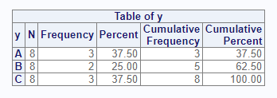

The above code illustrates a one-way frequency on the "y" variable.  The 
result shows that the "A" and "C" categories appears three times, and the "B" 
category appears twice.  The "N" column shows that there are eight items
in the population.  This population is used to get the percent shown for 
each frequency count.

## Control Columns

The `options` parameter can control many aspects of the `proc_freq()` function.
For example, if you did not want the cumulative frequency and percent,
you could turn off these columns with the option "nocum".
```{r eval=FALSE, echo=TRUE} 
# Turn off cumulative columns
proc_freq(dat, tables = y, options = nocum)

```
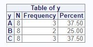

Let's say you wanted only the frequency counts, and not the other columns.
This result can be achieved with the following options.  Use the `v()` function
when you are passing multiple options:
```{r eval=FALSE, echo=TRUE} 
proc_freq(dat, tables = y, options = v(nocum, nonobs, nopercent))
```
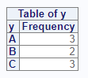

## Cross Tabulation

For two-way frequencies, you can cross two 
variables on the `tables` parameter.  This syntax produces a cross-tabulation
table by default:
```{r eval=FALSE, echo=TRUE} 
# Create crosstab
proc_freq(dat, tables = y * x)

```
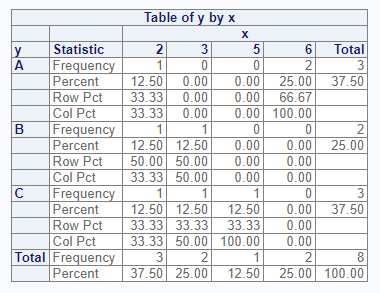

## Cross Tabulation Options

If you want the data displayed in a list instead of a cross-tabulation 
table, you can do that with the "list" option.  The "nosparse" option
will turn off zero-count categories, which are included by default:
```{r eval=FALSE, echo=TRUE} 
# Two-way frequency in list form
proc_freq(dat, tables = y * x, options = v(list, nosparse))
```
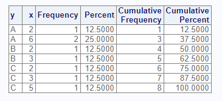

The following options turn off various features of the cross-tabulation
table:
```{r eval=FALSE, echo=TRUE} 
# View frequencies only
proc_freq(dat, tables = y * x, 
          options = v(norow, nocol, nopercent))
```
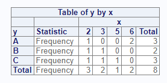

## Multiple Tables

The `tables` parameter accepts more than one table request.  To request
multiple tables, pass a quoted or unquoted vector. Note that 
`proc_freq()` does not accept grouping syntax, such as that allowed by SAS®.
You must specify each cross-tab individually:
```{r eval=FALSE, echo=TRUE} 
# Request two crosstabs
proc_freq(dat, tables = v(y * x, y * z), 
          options = v(norow, nocol, nopercent))
```
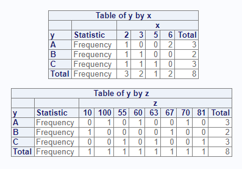

## Distinct Values

The "nlevels" option can be used to count the number of distinct values 
in a categorical variable:
```{r eval=FALSE, echo=TRUE} 
# Turn on nlevels option
proc_freq(dat, tables = y, options = nlevels)
```
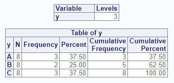

## Weighted Frequencies

The `weight` parameter is used to achieve weighted frequencies.  When a 
weight is specified, `proc_freq()` will use the counts in the indicated 
variable for all frequency calculations.
```{r eval=FALSE, echo=TRUE} 
# Add weight variable
proc_freq(dat, tables = y, weight = z)
```
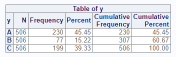


## Statistics Options
The `options` parameter also accepts statistics options.  For two-way tables,
you may request either Chi-Square or Fisher's tests of association.
Here is an example of the Chi-Square test:
```{r eval=FALSE, echo=TRUE} 
# Request Chi-Square and Output datasets
res <- proc_freq(dat, tables = y * x, options = chisq)
```
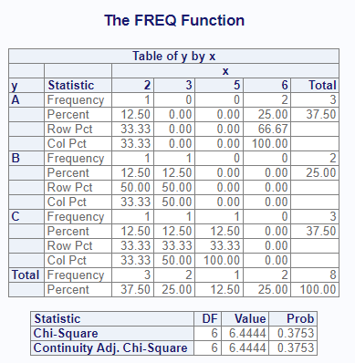

```{r eval=FALSE, echo=TRUE} 
# View results
res
# $`y * x`
#    VAR1 VAR2 CAT1 CAT2 N CNT  PCT
# 1     y    x    A    2 8   1 12.5
# 2     y    x    A    3 8   0  0.0
# 3     y    x    A    5 8   0  0.0
# 4     y    x    A    6 8   2 25.0
# 5     y    x    B    2 8   1 12.5
# 6     y    x    B    3 8   1 12.5
# 7     y    x    B    5 8   0  0.0
# 8     y    x    B    6 8   0  0.0
# 9     y    x    C    2 8   1 12.5
# 10    y    x    C    3 8   1 12.5
# 11    y    x    C    5 8   1 12.5
# 12    y    x    C    6 8   0  0.0
# 
# $`chisq:y * x`
#                         STAT DF      VAL      PROB
# 1                 Chi-Square  6 6.444444 0.3752853
# 2 Continuity Adj. Chi-Square  6 6.444444 0.3752853

```

## Output Datasets

You may control datasets returned from the `proc_freq()` function using the `output`
parameter.  This parameter takes three basic values: "out", "report", and "none".
The "out" keyword requests datasets meant for output, and is the default.
These datasets have standardized column names, and sometimes have additional
columns to help with data manipulation.  The "report" keyword requests
the exact datasets used to create the interactive report. For both keywords, 
if there is more than one dataset, they will be returned as a list of datasets.
The name of the list item will identify the dataset. You may
specify the names of the output tables in the list by using a 
named table request. 

Here is an example of the "out" option:
```{r eval=FALSE, echo=TRUE} 
# Request output data
res <- proc_freq(dat, tables = v(x, y, MyCross = y * x), 
                 output = out)

# View results
res
$x
  VAR CAT N CNT  PCT
1   x   2 8   3 37.5
2   x   3 8   2 25.0
3   x   5 8   1 12.5
4   x   6 8   2 25.0

$y
  VAR CAT N CNT  PCT
1   y   A 8   3 37.5
2   y   B 8   2 25.0
3   y   C 8   3 37.5

$MyCross
   VAR1 VAR2 CAT1 CAT2 N CNT  PCT
1     y    x    A    2 8   1 12.5
2     y    x    A    3 8   0  0.0
3     y    x    A    5 8   0  0.0
4     y    x    A    6 8   2 25.0
5     y    x    B    2 8   1 12.5
6     y    x    B    3 8   1 12.5
7     y    x    B    5 8   0  0.0
8     y    x    B    6 8   0  0.0
9     y    x    C    2 8   1 12.5
10    y    x    C    3 8   1 12.5
11    y    x    C    5 8   1 12.5
12    y    x    C    6 8   0  0.0

```
Notice that the way output datasets are requested from the `proc_freq()` function 
is much simpler than the corresponding mechanism in SAS®.  With `proc_freq()`, 
by default, all requested tables and statistics will be
returned in a list. No other output parameters are needed.

## Output Ordering

The `order` parameter allows the user to control the sort order of the outputs
from `proc_freq()`. The possible `order` values are "internal", "data",
"freq", and "formatted". These choices align with the corresponding procedure
from SAS.  What is different with `proc_freq()` is that the ordering applies
to both the interactive report and the data frame output.

Let's illustrate by taking the weighted frequency example from above, and 
request an order by frequency counts.
```
# Order by frequency counts
res <- proc_freq(dat, 
                 tables = y, 
                 weight = z,
                 order = freq)

# View return data frame
# Ordered by frequencies
res
#   VAR CAT   N CNT      PCT
# 1   y   A 506 230 45.45455
# 2   y   C 506 199 39.32806
# 3   y   B 506  77 15.21739

```
Notice how the output table is ordered by frequency count instead of the 
alphabetical value of "CAT", which is the default.

The interactive report shows the same ordering:


The `order` parameter gives you control over the sort order of `proc_freq()`
results, which can help streamline the processing of your data. Yet 
`proc_freq()` contains still more capabilities to streamline the processing
of your data.

## Data Shaping

The `proc_freq()` function provides three options for shaping data:
"wide", "long", and "stacked".  These options control how the output
data is organized.  The options are also passed on the `output` parameter.
The shaping options are best illustrated by an example:
```{r eval=FALSE, echo=TRUE} 
# Shape wide
res1 <- proc_freq(dat, tables = y, 
                  output = wide)

# Wide results
res1
#   VAR CAT N CNT  PCT
# 1   y   A 8   3 37.5
# 2   y   B 8   2 25.0
# 3   y   C 8   3 37.5

# Shape long
res2 <- proc_freq(dat, tables = y, 
                  output = long)

# Long results
res2
#   VAR STAT    A  B    C
# 1   y    N  8.0  8  8.0
# 2   y  CNT  3.0  2  3.0
# 3   y  PCT 37.5 25 37.5

# Shape stacked
res3 <- proc_freq(dat, tables = y, 
                  output = stacked)

# Stacked results
res3
#   VAR CAT STAT VALUES
# 1   y   A    N    8.0
# 2   y   A  CNT    3.0
# 3   y   A  PCT   37.5
# 4   y   B    N    8.0
# 5   y   B  CNT    2.0
# 6   y   B  PCT   25.0
# 7   y   C    N    8.0
# 8   y   C  CNT    3.0
# 9   y   C  PCT   37.5

```
As seen above, the "wide" option places the statistics in columns across the 
top of the dataset and the categories in rows.  This shaping option is the default. 
The "long" option places the statistics in rows, with each category in columns.
The "stacked" option places both the statistics and the categories in rows. 

These shaping options reduce some of the manipulation needed to get your 
data in the desired form. These options were added for convenience during
the development of the **procs** package, and have no equivalent in SAS®.

## Frequency Plots

To better understand your data, it is valuable to visualize it.  The 
`proc_freq()` function offers basic plotting of frequencies via the 
"plots" parameter and the `freqplot()` function.  

### Default Plots

Here is a simple example 
demonstrating how to get default frequency plots for a selection of tables
using the sample data from above:
```
proc_freq(dat, tables = v(x, y, x * y),
          weight = z,
          plots = TRUE)

```
The generated report will look like this:


The report now shows a bar chart for each of the table requests. Note that on
the two-way interaction, a bar chart is produced for each interaction and
place onto a single panel.  If the interactions do not fit on a single panel,
additional panels will be generated.

### Customized Plots

The `plots` parameter on `proc_freq()` also accepts a `freqplot()` object.
This object offers some customization of the requested plot.  Besides the 
default frequency chart produced in the example above, you may also request
dot plots, stacked bar charts, or clustered bar charts.  The `freqplot()`
function also allows you to control the chart's orientation, scale, and
other basic aspects of the plot.

If your call to `proc_freq()` has multiple tables, you can pass a single 
`freqplot()` object that applies to all tables.  You may also 
customize the charts for each table in the 
`proc_freq()` call. To customize the charts for each table, pass separate 
calls to `freqplot()` in list, like this: 

```
proc_freq(dat, tables = v(x, y, x * y),
          weight = z,
          plots = list(freqplot(type = "dotplot"),
                       freqplot(orient = "horizontal"),
                       freqplot(twoway = "stacked")))
                       

```

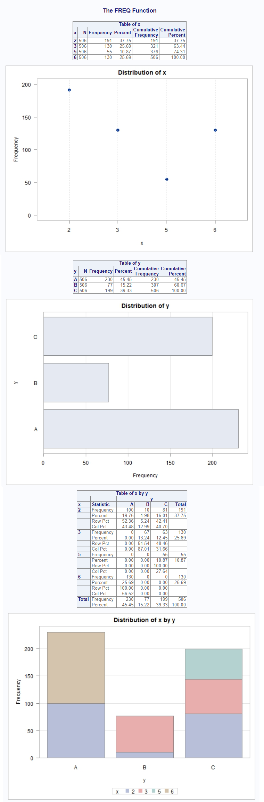

Modifying the `freqplot()` parameters can help improve the quality of your 
chart, and make it easier to understand what is happening with your data.
See the `freqplot()` documentation for more information on how to customize
your frequency plots.


Next: [The Means Function](procs-means.html)
