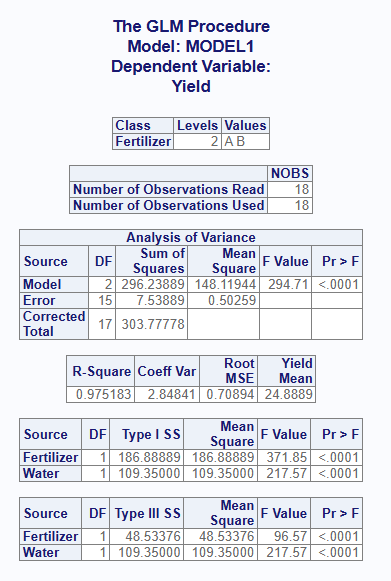
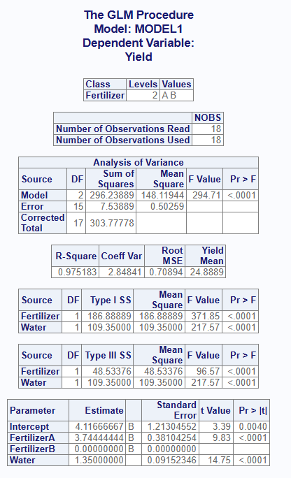
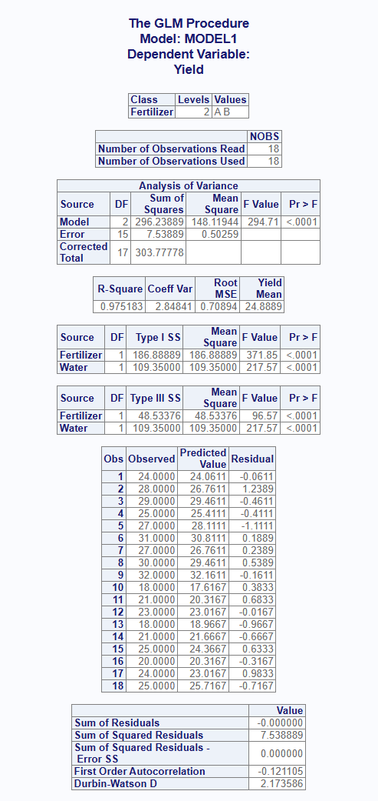
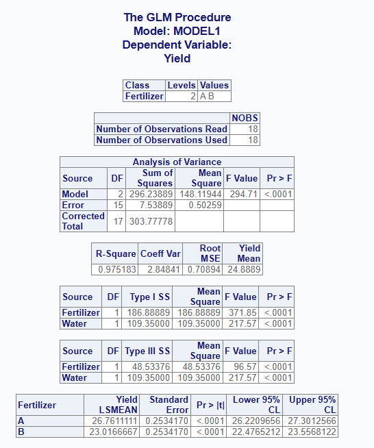

```{r setup, include = FALSE}
knitr::opts_chunk$set(
  collapse = TRUE,
  comment = "#>"
)
```
The `proc_glm()` function replicates a SAS® PROC GLM procedure.  It is used to
perform a general linear model analysis.  Unlike `proc_reg()`, the `proc_glm()`
function accepts categorical predictors through the `class` parameter, and
produces Type I, Type II, and Type III sums of squares.  The function is both
interactive and returns datasets.

## Create Sample Data

Below is some sample data.  This sample data shows the Fertilizer, Water,
Yield, and Field for a group of plants.  In this example, we'll examine the
relationship between Yield and Fertilizer type, adjusting for the amount of
Water each plot received:
```{r eval=FALSE, echo=TRUE}
# Create sample data
plants <- read.table(header = TRUE, text = '
  Plot Fertilizer Water Yield Field
  1    A          12    24    North
  2    A          14    28    North
  3    A          16    29    North
  4    A          13    25    North
  5    A          15    27    South
  6    A          17    31    South
  7    A          14    27    South
  8    A          16    30    South
  9    A          18    32    South
  10   B          10    18    North
  11   B          12    21    North
  12   B          14    23    North
  13   B          11    18    North
  14   B          13    21    South
  15   B          15    25    South
  16   B          12    20    South
  17   B          14    24    South
  18   B          16    25    South')

```
## Basic Analysis

If no options are specified, the `proc_glm()` function will produce
an interactive report in the RStudio viewer.  The report contains the
following tables:

* **ClassLevels**: The number of levels and the values for each variable
listed on the `class` parameter.
* **NObs**:  The number of used and unused observations in the input
dataset.  If there are missing values in any of the dependent or independent
variables, these observations will be removed from the input dataset, and a
count of observations with missing values will also be shown in this table.
* **ANOVA**: A table showing the Analysis of Variance for the model, the Error,
and a Corrected Total.  This table includes the Degrees of Freedom, Sum of
Squares, Mean Square, and the F and P values for the model.
* **FitStatistics**: The fitness table shows measures related to fitness, such
as the Root MSE, R-Square value, Coefficient of Variation, and dependent mean.
* **TypeI** and **TypeIII**: These tables show the Type I and Type III sums of
squares for each term in the model.  The Type I ("sequential") values depend on
the order the terms enter the model, while the Type III ("partial") values are
adjusted for all other terms.  The two will differ whenever the predictors are
correlated.

Note that categorical variables must be identified with the `class` parameter.
The variable name may be quoted, or passed unquoted using the `v()` function.

```{r eval=FALSE, echo=TRUE}
# Turn off printing for CRAN checks
options("procs.print" = FALSE)

# Basic operation
proc_glm(plants, Yield ~ Fertilizer + Water, class = Fertilizer)

```


## Statistics Options

The `proc_glm()` function has two ways to pass optional statistics: `stats` and
`options`.

The `stats` parameter contains options that are normally passed on the "model"
statement in SAS® PROC GLM. Here is a table of the available `stats` keywords:

<table>
<tr><th>Keyword</th><th>Description</th></tr>
<tr><td>ss1</td><td>Adds the Type I (sequential) sums of squares to the output.</td></tr>
<tr><td>ss2</td><td>Adds the Type II (partial) sums of squares to the output.</td></tr>
<tr><td>ss3</td><td>Adds the Type III (partial) sums of squares to the output.</td></tr>
<tr><td>solution</td><td>Requests a parameter estimates table be added to the
interactive report.  The keyword "est" is an accepted alias.</td></tr>
<tr><td>clparm</td><td>Requests confidence limits be added to the parameter
estimates table.  The keyword "clb" is an accepted alias.</td></tr>
<tr><td>p</td><td>Computes predicted and residual values and sends them to
separate tables on the interactive report.</td></tr>
</table>

Here is a table of the `options` keywords:

<table>
<tr><th>Keyword</th><th>Description</th></tr>
<tr><td>alpha</td><td>The "alpha = " option will set the alpha value for confidence limit statistics.</td></tr>
<tr><td>noprint</td><td>Turns off the interactive report that is sent to the viewer.</td></tr>
<tr><td>outstat</td><td>Requests the sums of squares be sent to the output
dataset.  This is the default output dataset, so the option does not normally
need to be passed.</td></tr>
</table>

## Output Dataset Options

In addition to the interactive report shown above, the `proc_glm()` function
produces output datasets.  You can save these datasets in a variable and use it
for additional analysis or reporting.  Here is how to save the default output
dataset:

```{r eval=FALSE, echo=TRUE}
# Output dataset
res1 <- proc_glm(plants, Yield ~ Fertilizer + Water, class = Fertilizer)

# View results
res1
#    MODEL DEPVAR     SOURCE TYPE DF        SS    MEANSQ     FVAL        PROBF
# 1 MODEL1  Yield Fertilizer  SS1  1 186.88889 186.88889 371.8497 5.349832e-12
# 2 MODEL1  Yield      Water  SS1  1 109.35000 109.35000 217.5718 2.459793e-10
# 3 MODEL1  Yield Fertilizer  SS3  1  48.53376  48.53376  96.5668 6.284856e-08
# 4 MODEL1  Yield      Water  SS3  1 109.35000 109.35000 217.5718 2.459793e-10
```

The default output dataset contains the Type I and Type III sums of squares
for each term in the model.  Notice how the Type I and Type III sums of squares
for Fertilizer differ, because the Fertilizer plots also received different
amounts of Water.

If you want only one type of sums of squares, request it with the `stats`
parameter.  For example, the "ss3" keyword returns only the Type III values:

```{r eval=FALSE, echo=TRUE}
# Output dataset using "ss3" keyword
res2 <- proc_glm(plants, Yield ~ Fertilizer + Water, class = Fertilizer,
                 stats = ss3)

# View results
res2
#    MODEL DEPVAR     SOURCE TYPE DF        SS    MEANSQ     FVAL        PROBF
# 1 MODEL1  Yield Fertilizer  SS3  1  48.53376  48.53376  96.5668 6.284856e-08
# 2 MODEL1  Yield      Water  SS3  1 109.35000 109.35000 217.5718 2.459793e-10
```

If you want to return the statistics from the interactive report as data,
you can do that using `output = "report"`:

```{r eval=FALSE, echo=TRUE}
# Output using "report" output
res3 <- proc_glm(plants, Yield ~ Fertilizer + Water, class = Fertilizer,
                 output = "report")

# View results
res3
# $ClassLevels
#        CLASS LEVELS VALUES
# 1 Fertilizer      2    A B
#
# $NObs
#                         LABEL NOBS
# 1 Number of Observations Read   18
# 2 Number of Observations Used   18
#
# $ANOVA
#            SOURCE DF      SUMSQ      MEANSQ     FVAL        PROBF
# 1           Model  2 296.238889 148.1194444 294.7108 9.132695e-13
# 2           Error 15   7.538889   0.5025926       NA           NA
# 3 Corrected Total 17 303.777778          NA       NA           NA
#
# $FitStatistics
#         RSQ COEFVAR      RMSE  DEPMEAN
# 1 0.9751829 2.84841 0.7089377 24.88889
#
# $TypeI
#       SOURCE DF    SUMSQ   MEANSQ     FVAL        PROBF
# 1 Fertilizer  1 186.8889 186.8889 371.8497 5.349832e-12
# 2      Water  1 109.3500 109.3500 217.5718 2.459793e-10
#
# $TypeIII
#       SOURCE DF     SUMSQ    MEANSQ     FVAL        PROBF
# 1 Fertilizer  1  48.53376  48.53376  96.5668 6.284856e-08
# 2      Water  1 109.35000 109.35000 217.5718 2.459793e-10
```
This list of data frames may in turn be passed into `proc_print()` to
write the report to a file.

## Interactive Report Options

Some of the keyword options affect the interactive report.  Let's look at a few.

The "solution" keyword on the `stats` parameter adds a parameter estimates table
to the report.  These values can be used to construct the model.  Because the
`class` variable is coded against a reference level, the last level (here
Fertilizer B) is zeroed and flagged with a "B".  Adding the "clparm" keyword
appends confidence limits to this same table:

```{r eval=FALSE, echo=TRUE}
# View report using "solution" keyword
proc_glm(plants, Yield ~ Fertilizer + Water, class = Fertilizer,
         stats = solution)
```


The "p" keyword will add two more tables to the interactive report.
The first is a table of predicted and residual values for each observation.
The second is a summary table for the residuals:

```{r eval=FALSE, echo=TRUE}
# View report using "p" keyword
proc_glm(plants, Yield ~ Fertilizer + Water, class = Fertilizer,
         stats = p)
```


The `lsmeans` parameter adds a least-squares means table for a `class` effect.
The least-squares means are the group means adjusted for the other terms in the
model.  The `contrast` and `estimate` parameters may likewise be used to test
and estimate specific comparisons between the `class` levels:

```{r eval=FALSE, echo=TRUE}
# View report using "lsmeans" parameter
proc_glm(plants, Yield ~ Fertilizer + Water, class = Fertilizer,
         lsmeans = Fertilizer)
```


## By Groups

If you want to separate your analysis into by groups, use the `by` parameter.
For the interactive report, the function will create a separate set of tables
for each value of the by group.  For the output dataset, the by value will
be shown in a column called "BY". Here is an example:

```{r eval=FALSE, echo=TRUE}
# By grouping
res5 <- proc_glm(plants, Yield ~ Fertilizer + Water, class = Fertilizer,
                 by = Field)

# View results
res5
#      BY  MODEL DEPVAR     SOURCE TYPE DF        SS    MEANSQ      FVAL        PROBF
# 1 North MODEL1  Yield Fertilizer  SS1  1  84.50000  84.50000 122.71784 1.044349e-04
# 2 North MODEL1  Yield      Water  SS1  1  31.55714  31.55714  45.82988 1.068828e-03
# 3 North MODEL1  Yield Fertilizer  SS3  1  19.96891  19.96891  29.00049 2.977727e-03
# 4 North MODEL1  Yield      Water  SS3  1  31.55714  31.55714  45.82988 1.068828e-03
# 5 South MODEL1  Yield Fertilizer  SS1  1 102.40000 102.40000 179.20000 3.042972e-06
# 6 South MODEL1  Yield      Water  SS1  1  39.20000  39.20000  68.60000 7.298423e-05
# 7 South MODEL1  Yield Fertilizer  SS3  1  21.60000  21.60000  37.80000 4.683778e-04
# 8 South MODEL1  Yield      Water  SS3  1  39.20000  39.20000  68.60000 7.298423e-05
```

For multiple by groups, pass the variable names as a quoted vector using
the `c()` function, or as an unquoted vector using the `v()` function.

## Multiple Models

An important feature of the `proc_glm()` function is the ability to specify
multiple model statements. This feature gives you the capability to easily run
and compare different models for the best fit.  To pass multiple models,
combine the models into a `list()`. For the interactive report,
multiple models will produce a separate set of report tables for each model.
For the output dataset, the models will be distinguished by the model name
on the "MODEL" column.

```{r eval=FALSE, echo=TRUE}
# Multiple Models
res6 <- proc_glm(plants, list(Yield ~ Fertilizer,
                              Yield ~ Fertilizer + Water),
                 class = Fertilizer, stats = ss3)

# View results
res6
#    MODEL DEPVAR     SOURCE TYPE DF        SS    MEANSQ      FVAL        PROBF
# 1 MODEL1  Yield Fertilizer  SS3  1 186.88889 186.88889  25.58175 1.164801e-04
# 2 MODEL2  Yield Fertilizer  SS3  1  48.53376  48.53376  96.56680 6.284856e-08
# 3 MODEL2  Yield      Water  SS3  1 109.35000 109.35000 217.57185 2.459793e-10
```
Adding the Water covariate in the second model reduces the Fertilizer sum of
squares from 186.9 to 48.5, which shows how much of the apparent Fertilizer
effect was really due to differences in Water.

## Data Shaping

The `proc_glm()` function also offers options for data shaping.  The
shaping options can reduce the number of transformations needed for
follow-on analysis.

There are three shaping options: "wide", "long", and "stacked".  The "wide"
option is the default, and places the statistics in columns and sources in
rows.  The "long" option places statistics in rows and sources in columns.
The "stacked" option puts both statistics and sources in rows.

The following example illustrates the differences between these data
shaping options:
```{r eval=FALSE, echo=TRUE}
# Shape wide
res7 <- proc_glm(plants, Yield ~ Fertilizer + Water, class = Fertilizer,
                 stats = ss3, output = wide)

# Wide results
res7
#    MODEL DEPVAR     SOURCE TYPE DF        SS    MEANSQ     FVAL        PROBF
# 1 MODEL1  Yield Fertilizer  SS3  1  48.53376  48.53376  96.5668 6.284856e-08
# 2 MODEL1  Yield      Water  SS3  1 109.35000 109.35000 217.5718 2.459793e-10

# Shape long
res8 <- proc_glm(plants, Yield ~ Fertilizer + Water, class = Fertilizer,
                 stats = ss3, output = long)

# Long results
res8
#     MODEL DEPVAR     SOURCE TYPE   STAT         COL1
# 1  MODEL1  Yield Fertilizer  SS3     DF 1.000000e+00
# 2  MODEL1  Yield Fertilizer  SS3     SS 4.853376e+01
# 3  MODEL1  Yield Fertilizer  SS3 MEANSQ 4.853376e+01
# 4  MODEL1  Yield Fertilizer  SS3   FVAL 9.656680e+01
# 5  MODEL1  Yield Fertilizer  SS3  PROBF 6.284856e-08
# 6  MODEL1  Yield      Water  SS3     DF 1.000000e+00
# 7  MODEL1  Yield      Water  SS3     SS 1.093500e+02
# 8  MODEL1  Yield      Water  SS3 MEANSQ 1.093500e+02
# 9  MODEL1  Yield      Water  SS3   FVAL 2.175718e+02
# 10 MODEL1  Yield      Water  SS3  PROBF 2.459793e-10

# Shape stacked
res9 <- proc_glm(plants, Yield ~ Fertilizer + Water, class = Fertilizer,
                 stats = ss3, output = stacked)

# Stacked results
res9
#     MODEL DEPVAR     SOURCE TYPE   STAT       VALUES
# 1  MODEL1  Yield Fertilizer  SS3     DF 1.000000e+00
# 2  MODEL1  Yield Fertilizer  SS3     SS 4.853376e+01
# 3  MODEL1  Yield Fertilizer  SS3 MEANSQ 4.853376e+01
# 4  MODEL1  Yield Fertilizer  SS3   FVAL 9.656680e+01
# 5  MODEL1  Yield Fertilizer  SS3  PROBF 6.284856e-08
# 6  MODEL1  Yield      Water  SS3     DF 1.000000e+00
# 7  MODEL1  Yield      Water  SS3     SS 1.093500e+02
# 8  MODEL1  Yield      Water  SS3 MEANSQ 1.093500e+02
# 9  MODEL1  Yield      Water  SS3   FVAL 2.175718e+02
# 10 MODEL1  Yield      Water  SS3  PROBF 2.459793e-10

```

Next: [Data Manipulation](procs-dm.html)
