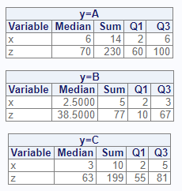
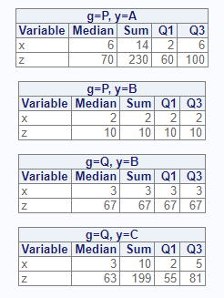

```{r setup, include = FALSE}
knitr::opts_chunk$set(
  collapse = TRUE,
  comment = "#>"
)
```
The `proc_means` function simulates a SAS® PROC MEANS procedure.  It is used to
generate summary statistics on numeric variables.  The function is both 
interactive and returns datasets.   

## Create Sample Data

Let's again create some sample data.  This sample data is identical to that
created for the `proc_freq` tutorial, but has an additional grouping 
variable "g":  
```{r eval=FALSE, echo=TRUE} 
# Create sample data
dat <- read.table(header = TRUE, 
                  text = 'x y z   g
                          6 A 60  P
                          6 A 70  P
                          2 A 100 P
                          2 B 10  P
                          3 B 67  Q
                          2 C 81  Q
                          3 C 63  Q
                          5 C 55  Q')

# View sample data
dat
  x y   z g
1 6 A  60 P
2 6 A  70 P
3 2 A 100 P
4 2 B  10 P
5 3 B  67 Q
6 2 C  81 Q
7 3 C  63 Q
8 5 C  55 Q

```
## Get Summary Statistics

If no parameters are specified, the `proc_means` function will calculate
N, Means, Standard Deviation, Minimum, and Maximum on all numeric variables.  

Note that the `options` statement has been added to pass CRAN checks.
When you are running code samples, this statement may be omitted.
```{r eval=FALSE, echo=TRUE} 
# Turn off printing for CRAN checks
options("procs.print" = FALSE)

# No parameters
proc_means(dat)

```


## Selected Variables
If you don't want statistics on all numeric variables, you may specify
variables on the `var` parameter:
```{r eval=FALSE, echo=TRUE} 
# Specific variable
proc_means(dat, var = x)
```


## Statistics Options

The `proc_means` function has a `stats` parameter that allows you to control
which statistics are generated.  There are many statistics keywords.  Here is 
a sample of some of the most frequently used keywords:


<table>
<tr><th>Keyword</th><th>Description</th></tr>
<tr><td>N</td><td>Number of Observations</td></tr>
<tr><td>NMISS</td><td>Number of missing observations</td></tr>
<tr><td>MEAN</td><td>Arithmetic mean</td></tr>
<tr><td>STD</td><td>Standard Deviation</td></tr>
<tr><td>MIN</td><td>Minimum</td></tr>
<tr><td>MAX</td><td>Maximum</td></tr>
<tr><td>SUM</td><td>Sum of observations</td></tr>
<tr><td>MEDIAN</td><td>50th percentile</td></tr>
<tr><td>P1</td><td>1st percentile</td></tr>
<tr><td>P5</td><td>5st percentile</td></tr>
<tr><td>P10</td><td>10th percentile</td></tr>
<tr><td>P90</td><td>90th percentile</td></tr>
<tr><td>P95</td><td>95th percentile</td></tr>
<tr><td>P99</td><td>99th percentile</td></tr>
<tr><td>Q1</td><td>First Quartile</td></tr>
<tr><td>Q3</td><td>Third Quartile</td></tr>
</table>

Now that we know some statistics keywords, let's practice using them.
Here is an example which calculates the median, sum, first quartile,
and third quartile for all numeric variables in our sample data:

```{r eval=FALSE, echo=TRUE} 
# Custom statistics options
proc_means(dat, stats = v(median, sum, q1, q3))

```


## Output Datasets

Similar to the `proc_freq` function, `proc_means` can return datasets.
There are three options: "all", "report", and "none".  The 
"all" option returns datasets meant for further manipulation and analysis, and
is the default.
The "report" keyword requests the exact datasets used in the interactive
report.  Specifying either one of these options will cause the function
to return data.  

Here is an example that shows the difference in the "report" and "all" options:
```{r eval=FALSE, echo=TRUE} 
# Output dataset using "report" option
res1 <- proc_means(dat, 
                   stats = v(median, sum, q1, q3),
                   output = report)

# View results
res1
#   VAR MEDIAN SUM   Q1   Q3
# 1   x      3  29  2.0  5.5
# 2   z     65 506 57.5 75.5


# Output dataset using "all" option
res2 <- proc_means(dat, 
                   stats = v(median, sum, q1, q3),
                   output = all)

# View results
res2
#   TYPE FREQ VAR MEDIAN SUM   Q1   Q3
# 1    0    8   x      3  29  2.0  5.5
# 2    0    8   z     65 506 57.5 75.5

```
As can be seen in the above example, the "all" output datasets include additional
variables for TYPE and FREQ. These additional variables can be 
turned off with options:
```{r eval=FALSE, echo=TRUE} 

# Turn off TYPE and FREQ variables
res3 <- proc_means(dat, 
                   stats = v(median, sum, q1, q3),
                   output = all,
                   options = v(notype, nofreq))

# View results
res3
#   VAR MEDIAN SUM   Q1   Q3
# 1   x      3  29  2.0  5.5
# 2   z     65 506 57.5 75.5
```

## Grouping 

The `proc_means` function provides two grouping parameters: `class` and `by`.
These parameters identify a variable or variables for subsetting the input
data.  While these parameters have similar capabilities, there are some
difference between them.  The differences can be examined by comparing
the two function calls.

### Class
```{r eval=FALSE, echo=TRUE} 
# Class grouping
res1 <- proc_means(dat, stats = v(median, sum, q1, q3),
                   class = y)
```


Below is the output dataset from the `class` parameter.  Notice that 
summary values have been provided for each variable, in addition to the subsets
by the class variable.  The summary rows are identifed by TYPE = 0, while the
subset rows are TYPE = 1.  
```{r eval=FALSE, echo=TRUE} 
# View results - class
res1
#   CLASS TYPE FREQ VAR MEDIAN SUM   Q1    Q3
# 1  <NA>    0    8   x    3.0  29  2.0   5.5
# 2  <NA>    0    8   z   65.0 506 57.5  75.5
# 3     A    1    3   x    6.0  14  2.0   6.0
# 4     A    1    3   z   70.0 230 60.0 100.0
# 5     B    1    2   x    2.5   5  2.0   3.0
# 6     B    1    2   z   38.5  77 10.0  67.0
# 7     C    1    3   x    3.0  10  2.0   5.0
# 8     C    1    3   z   63.0 199 55.0  81.0

```
### By
Here is the same analysis using the `by` parameter instead of the `class`
parameter:

```{r eval=FALSE, echo=TRUE} 
# By grouping
res2 <- proc_means(dat, stats = v(median, sum, q1, q3),
                   by = y)

```


Notice that with the `by` parameter, separate tables are created for each
by group on the interactive report.  

Now let's look at the output dataset:
```{r eval=FALSE, echo=TRUE} 
# View results - by
res2
#   BY TYPE FREQ VAR MEDIAN SUM Q1  Q3
# 1  A    0    3   x    6.0  14  2   6
# 2  A    0    3   z   70.0 230 60 100
# 3  B    0    2   x    2.5   5  2   3
# 4  B    0    2   z   38.5  77 10  67
# 5  C    0    3   x    3.0  10  2   5
# 6  C    0    3   z   63.0 199 55  81
```
The output dataset is also different from the `class` output.
While the TYPE variables exists on the output dataset, 
the output data for the by group does not include the summary rows.  The 
summary rows are a feature of the `class` variable.  You should select 
the grouping parameter that most suits your needs.

## Multiple Groups
### Class
The `proc_means` function can perform analysis with multiple grouping variables.
First let's examine what happens when we pass multiple grouping variables to
the `class` parameter:
```{r eval=FALSE, echo=TRUE} 
# Class grouping - two variables
res1 <- proc_means(dat, stats = v(median, sum, q1, q3),
                   class = v(g, y))
```


Here is the output dataset:
```{r eval=FALSE, echo=TRUE} 
# View results - two class variables
res1
#    CLASS1 CLASS2 TYPE FREQ VAR MEDIAN SUM   Q1    Q3
# 1    <NA>   <NA>    0    8   x      3  29  2.0   5.5
# 2    <NA>   <NA>    0    8   z     65 506 57.5  75.5
# 3       P      A    1    3   x      6  14  2.0   6.0
# 4       P      A    1    3   z     70 230 60.0 100.0
# 5       P      B    1    1   x      2   2  2.0   2.0
# 6       P      B    1    1   z     10  10 10.0  10.0
# 7       Q      B    1    1   x      3   3  3.0   3.0
# 8       Q      B    1    1   z     67  67 67.0  67.0
# 9       Q      C    1    3   x      3  10  2.0   5.0
# 10      Q      C    1    3   z     63 199 55.0  81.0
```

### By
Now let's see what happens when we use the `by` parameter with
two variables:
```{r eval=FALSE, echo=TRUE} 
# By grouping - two variables
res2 <- proc_means(dat, stats = v(median, sum, q1, q3),
                   by = v(g, y))
```


Here is the output dataset for the `by` parameter:
```{r eval=FALSE, echo=TRUE} 
# View results - two by variables
res2
#   BY1 BY2 TYPE FREQ VAR MEDIAN SUM Q1  Q3
# 1   P   A    0    3   x      6  14  2   6
# 2   P   A    0    3   z     70 230 60 100
# 3   P   B    0    1   x      2   2  2   2
# 4   P   B    0    1   z     10  10 10  10
# 5   Q   B    0    1   x      3   3  3   3
# 6   Q   B    0    1   z     67  67 67  67
# 7   Q   C    0    3   x      3  10  2   5
# 8   Q   C    0    3   z     63 199 55  81
```
### By and Class

Finally, let's see what happens when we specify both `by` and `class` 
parameters:
```{r eval=FALSE, echo=TRUE} 
# By grouping - by and class
res3 <- proc_means(dat, stats = v(median, sum, q1, q3),
                   by = g,
                   class = y)
```


```{r eval=FALSE, echo=TRUE} 
# View results - by and class
res3
#    BY CLASS TYPE FREQ VAR MEDIAN SUM   Q1  Q3
# 1   P  <NA>    0    4   x      4  16  2.0   6
# 2   P  <NA>    0    4   z     65 240 35.0  85
# 3   P     A    1    3   x      6  14  2.0   6
# 4   P     A    1    3   z     70 230 60.0 100
# 5   P     B    1    1   x      2   2  2.0   2
# 6   P     B    1    1   z     10  10 10.0  10
# 7   Q  <NA>    0    4   x      3  13  2.5   4
# 8   Q  <NA>    0    4   z     65 266 59.0  74
# 9   Q     B    1    1   x      3   3  3.0   3
# 10  Q     B    1    1   z     67  67 67.0  67
# 11  Q     C    1    3   x      3  10  2.0   5
# 12  Q     C    1    3   z     63 199 55.0  81

```

## Data Shaping

The `proc_means` function also offers options for data shaping.  The
shaping options can reduce the number of transformations needed to
get to your target table.  

There are three shaping options: "wide", "long", and "stacked".  The "wide"
options is the default, and has the statistics in columns and variables in
rows.  The "long" option has statistics in rows and variables in columns.
The "stacked" option has both statistics and variables in rows.  

The following example illustrates the differences between these data
shaping options:
```{r eval=FALSE, echo=TRUE} 
# Shape wide
res1 <- proc_means(dat, stats = v(median, sum, q1, q3),
                   options = wide)

# Wide results
res1
#   TYPE FREQ VAR MEDIAN SUM   Q1   Q3
# 1    0    8   x      3  29  2.0  5.5
# 2    0    8   z     65 506 57.5 75.5

# Shape long
res2 <- proc_means(dat, stats = v(median, sum, q1, q3),
                   options = long))

# Long results
res2
#   TYPE FREQ   STAT    x     z
# 1    0    8 MEDIAN  3.0  65.0
# 2    0    8    SUM 29.0 506.0
# 3    0    8     Q1  2.0  57.5
# 4    0    8     Q3  5.5  75.5

# Shape stacked
res3 <- proc_means(dat, stats = v(median, sum, q1, q3),
                   options = stacked)

# Stacked results
res3
#   TYPE FREQ VAR   STAT VALUES
# 1    0    8   x MEDIAN    3.0
# 2    0    8   x    SUM   29.0
# 3    0    8   x     Q1    2.0
# 4    0    8   x     Q3    5.5
# 5    0    8   z MEDIAN   65.0
# 6    0    8   z    SUM  506.0
# 7    0    8   z     Q1   57.5
# 8    0    8   z     Q3   75.5

```


Next: [Proc Transpose](procs-transpose.html)
