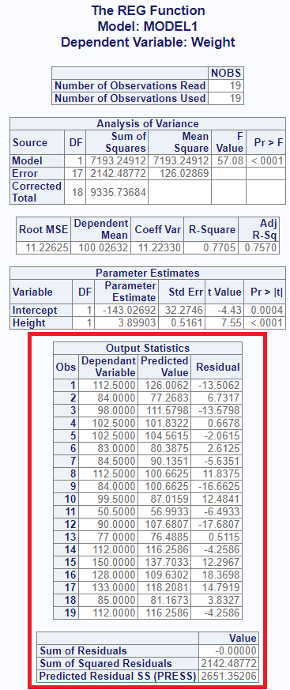

```{r setup, include = FALSE}
knitr::opts_chunk$set(
  collapse = TRUE,
  comment = "#>"
)
```
The `proc_reg()` function replicates a SAS® PROC REG procedure.  It is used to
perform a regression analysis.  The function is both 
interactive and returns datasets.   

## Create Sample Data

Below is some sample data.  This sample data shows Sex, Age, Height,
and Weight for a group of students.  In this example, we'll examine the relationship
between Weight and Height:  
```{r eval=FALSE, echo=TRUE} 
# Create sample data
cls <- read.table(header = TRUE, text = '
  Name   Sex Age Height Weight 
  Alfred   M  14   69.0  112.5
  Alice    F  13   56.5   84.0 
  Barbara  F  13   65.3   98.0 
  Carol    F  14   62.8  102.5 
  Henry    M  14   63.5  102.5 
  James    M  12   57.3   83.0 
  Jane     F  12   59.8   84.5 
  Janet    F  15   62.5  112.5
  Jeffrey  M  13   62.5   84.0 
  John     M  12   59.0   99.5 
  Joyce    F  11   51.3   50.5 
  Judy     F  14   64.3   90.0
  Louise   F  12   56.3   77.0
  Mary     F  15   66.5  112.0 
  Philip   M  16   72.0  150.0
  Robert   M  12   64.8  128.0
  Ronald   M  15   67.0  133.0
  Thomas   M  11   57.5   85.0
  William  M  15   66.5  112.0')

```
## Basic Regression

If no options are specified, the `proc_reg()` function will produce 
an interactive report in the RStudio viewer.  The report contains four tables:

* **NObs**:  The number of used and unused observations in the input 
dataset.  If there are missing values in any of the dependent or independent variables,
these observations will be removed from the input dataset, and a count of 
observations with missing values will also be shown in this table.
* **ANOVA**: A table showing the Analysis of Variance for the model, the Error,
and a Corrected Total.  This table includes the Degrees of Freedom, Sum of Squares,
Mean Square, and the F and P values for the model.
* **FitStatistics**: The Fitness table shows measures related to fitness, such as the
Root MSE, R-Square value, and Adjusted R-Square.
* **ParameterEstimates**: This table includes parameter estimates for 
the y intercept and any independent variables.  These values can be used
to construct the model. This table also contains the t and p-values necessary 
to determine the significance of the coefficient.

```{r eval=FALSE, echo=TRUE} 
# Turn off printing for CRAN checks
options("procs.print" = FALSE)

# Basic operation
proc_reg(cls, Weight ~ Height)

```


## Statistics Options

The `proc_reg()` function has two ways to pass optional statistics: `stats` and `options`.

The `stats` parameter contains options that are normally passed on the "model"
statement in SAS® PROC REG. Here is a table of some of the available `stats` 
keywords:

<table>
<tr><th>Keyword</th><th>Description</th></tr>
<tr><td>adjrsq</td><td>Adds adjusted r-square value to the output dataset.</td></tr>
<tr><td>clb</td><td>Requests confidence limits be added to the interactive report.</td></tr>
<tr><td>edf</td><td>Includes the number of regressors, the error degress of freedom, 
and the model r-square to the output dataset.</td></tr>
<tr><td>hcc</td><td>The "hcc" statistics keyword requests that 
heteroscedasticity-consistent standard errors of the parameter estimates 
be sent to the interactive report.</td></tr>
<tr><td>mse</td><td>Computes the mean squared error for each model and adds 
to the output dataset.</td></tr>
<tr><td>p</td><td>Computes predicted and residual values and sends to
a separate table on the interactive report.</td></tr>
<tr><td>press</td><td>Includes the predicted sum of squares statistic 
in the output dataset.</td></tr>
<tr><td>seb</td><td>Outputs the standard errors of the parameter 
estimates to the output dataset.</td></tr>
<tr><td>spec</td><td>Adds the "White's test" table to the 
interactive output.</td></tr>
<tr><td>sse</td><td>Adds the error sum of squares to the output dataset.</td></tr>
</table>

Here is a table of some of the `options` keywords:

<table>
<tr><th>Keyword</th><th>Description</th></tr>
<tr><td>alpha</td><td>The "alpha = " option will set the alpha value for confidence limit statistics.</td></tr>
<tr><td>noprint</td><td>Turns off the interactive report that is sent to the viewer.</td></tr>
<tr><td>outseb</td><td>The "outseb" option is used to request the standard 
errors be sent to the output dataset.</td></tr>
<tr><td>tableout</td><td>The "tableout" option is used to send standard errors, 
t-statistics, p-values, and confidence limits to the output dataset.</td></tr>
</table>

## Output Dataset Options

In addition to the interactive report shown above, the `proc_reg()` function produces
output datasets.  You can save these datasets in a variable and use it
for additional analysis or reporting.  Here is how to save the default output dataset:

```{r eval=FALSE, echo=TRUE} 
# Output dataset 
res1 <- proc_reg(cls, Weight ~ Height)

# View results
res1
#    MODEL  TYPE DEPVAR     RMSE Intercept  Height Weight
# 1 MODEL1 PARMS Weight 11.22625 -143.0269 3.89903     -1
```

The default output dataset contains parameter estimates and root means squared error.
If you want the standard errors, you can use the "outseb" option.

```{r eval=FALSE, echo=TRUE} 
# Output dataset using "outseb" option
res2 <- proc_reg(cls, Weight ~ Height, options = outseb)

# View results
res2
#    MODEL  TYPE DEPVAR     RMSE  Intercept    Height Weight
# 1 MODEL1 PARMS Weight 11.22625 -143.02692 3.8990303     -1
# 2 MODEL1   SEB Weight 11.22625   32.27459 0.5160939     -1
```

You can add more statistics to this dataset using various options.  For example,
you can add the "PRESS", error degrees of freedom, and r-squared statistic in
the following way:

```{r eval=FALSE, echo=TRUE} 
# Output dataset using "press" and "edf" options
res3 <- proc_reg(cls, Weight ~ Height, options = v(press, edf))

# View results
res3
#    MODEL  TYPE DEPVAR     RMSE    PRESS Intercept  Height Weight IN P EDF       RSQ
# 1 MODEL1 PARMS Weight 11.22625 2651.352 -143.0269 3.89903     -1  1 2  17 0.7705068
```

The "tableout" option sends standard error, confidence limits, t, and p-values
to the output dataset:

```{r eval=FALSE, echo=TRUE} 
# Output dataset using "tableout" option
res3 <- proc_reg(cls, Weight ~ Height, options = tableout)

# View results
res3
#    MODEL   TYPE DEPVAR     RMSE     Intercept       Height Weight
# 1 MODEL1  PARMS Weight 11.22625 -1.430269e+02 3.899030e+00     -1
# 2 MODEL1 STDERR Weight 11.22625  3.227459e+01 5.160939e-01     NA
# 3 MODEL1      T Weight 11.22625 -4.431564e+00 7.554885e+00     NA
# 4 MODEL1 PVALUE Weight 11.22625  3.655789e-04 7.886816e-07     NA
# 5 MODEL1   L95B Weight 11.22625 -2.111204e+02 2.810167e+00     NA
# 6 MODEL1   U95B Weight 11.22625 -7.493348e+01 4.987893e+00     NA
```

If you want to return the statistics from the interactive report as data, 
you can do that using `output = "report"`:

```{r eval=FALSE, echo=TRUE} 
# Output dataset using "report" output
res4 <- proc_reg(cls, Weight ~ Height, output = "report")

# View results
res4
# $Observations
#                          stub NOBS
# 1 Number of Observations Read   19
# 2 Number of Observations Used   19
# 
# $ANOVA
#              stub DF    SUMSQ    MEANSQ     FVAL        PROBF
# 1           Model  1 7193.249 7193.2491 57.07628 7.886816e-07
# 2           Error 17 2142.488  126.0287       NA           NA
# 3 Corrected Total 18 9335.737        NA       NA           NA
# 
# $Fitness
#       RMSE  DEPMEAN COEFVAR       RSQ    ADJRSQ
# 1 11.22625 100.0263 11.2233 0.7705068 0.7570072
# 
# $Coefficients
#        stub DF        EST     STDERR         T        PROBT
# 1 Intercept  1 -143.02692 32.2745913 -4.431564 3.655789e-04
# 2    Height  1    3.89903  0.5160939  7.554885 7.886816e-07
```
This list of data frames may in turn be passed into `proc_print()` to
write the report to a file.

## Interactive Report Options

Some of the keyword options affect the interactive report.  Let's look at a few.

The "clb" keyword on the `stats` parameter appends the confidence limits to
the parameter estimates table:

```{r eval=FALSE, echo=TRUE} 
# View report using "clb" option
proc_reg(cls, Weight ~ Height, stats = clb)
```


The "hcc" option sends heteroscedasticity consistent standard error, t, and 
p-values to the estimates table:

```{r eval=FALSE, echo=TRUE} 
# View report using "hcc" option
proc_reg(cls, Weight ~ Height, stats = hcc)
```


Finally, the "p" keyword will add 2 more tables to the interactive report.
The first is a table of predicted and residual
values for each term of the dependent variable.  The second is a summary table
for residuals:

```{r eval=FALSE, echo=TRUE} 
# View report using "p" option
proc_reg(cls, Weight ~ Height, stats = p)
```


## By Groups 

If you want to separate your analysis into by groups, use the `by` parameter.
For the interactive report, the function will create a separate set of tables
for each value of the by group.  For the output dataset, the by value will
be shown in a column called "BY". Here is an example:

```{r eval=FALSE, echo=TRUE} 
# By grouping
res5 <- proc_reg(cls, Weight ~ Height, by = Sex) 

# View results
res5
#   BY  MODEL  TYPE DEPVAR      RMSE Intercept   Height Weight
# 1  F MODEL1 PARMS Weight  9.586849 -117.3698 3.424405     -1
# 2  M MODEL1 PARMS Weight 12.695426 -141.1010 3.912549     -1
```
And here is the interactive report for the by group:


For multiple by groups, pass the variable names as a quoted vector using 
the `c()` function, or as an
unquoted vector using the `v()` function.

## Multiple Models

An important feature of the `proc_reg()` function is the ability to specify multiple
model statements. This feature gives you the capability to easily run and
compare different models for the best fit.  To pass multiple models,
combine the models into a `list()`. For the interactive report, 
multiple models will produce a separate set of report tables for each model.
For the output dataset, the models will be distinguished by the model name
on the "MODEL" column.

```{r eval=FALSE, echo=TRUE} 
# Multiple Models
res6 <- proc_reg(cls, list(Weight ~ Height,
                           Weight ~ Height + Age)) 

# View results
res6
#    MODEL  TYPE DEPVAR     RMSE Intercept   Height Weight      Age
# 1 MODEL1 PARMS Weight 11.22625 -143.0269 3.899030     -1       NA
# 2 MODEL2 PARMS Weight 11.51114 -141.2238 3.597027     -1 1.278393
```
Here is the interactive display for the two models:


## Data Shaping

The `proc_reg` function also offers options for data shaping.  The
shaping options can reduce the number of transformations needed for 
follow-on analysis.  

There are three shaping options: "wide", "long", and "stacked".  The "wide"
option is the default, and places the statistics in columns and variables in
rows.  The "long" option places statistics in rows and variables in columns.
The "stacked" option puts both statistics and variables in rows.  

The following example illustrates the differences between these data
shaping options:
```{r eval=FALSE, echo=TRUE} 
# Shape wide
res7 <- proc_reg(cls, Weight ~ Height, 
                 option = outseb, output = wide)

# Wide results
res7
#    MODEL  TYPE DEPVAR     RMSE  Intercept    Height Weight
# 1 MODEL1 PARMS Weight 11.22625 -143.02692 3.8990303     -1
# 2 MODEL1   SEB Weight 11.22625   32.27459 0.5160939     -1

# Shape long
res8 <- proc_reg(cls, Weight ~ Height, 
                 option = outseb, output = long)

# Long results
res8
#    MODEL DEPVAR      STAT      PARMS        SEB
# 1 MODEL1 Weight      RMSE   11.22625 11.2262500
# 2 MODEL1 Weight Intercept -143.02692 32.2745913
# 3 MODEL1 Weight    Height    3.89903  0.5160939
# 4 MODEL1 Weight    Weight   -1.00000 -1.0000000

# Shape stacked
res9 <- proc_reg(cls, Weight ~ Height, 
                 options = outseb, output = stacked)

# Stacked results
res9
#    MODEL DEPVAR  TYPE      STAT       VALUES
# 1 MODEL1 Weight PARMS      RMSE   11.2262500
# 2 MODEL1 Weight PARMS Intercept -143.0269184
# 3 MODEL1 Weight PARMS    Height    3.8990303
# 4 MODEL1 Weight PARMS    Weight   -1.0000000
# 5 MODEL1 Weight   SEB      RMSE   11.2262500
# 6 MODEL1 Weight   SEB Intercept   32.2745913
# 7 MODEL1 Weight   SEB    Height    0.5160939
# 8 MODEL1 Weight   SEB    Weight   -1.0000000

```


Next: [Data Manipulation](procs-dm.html)
