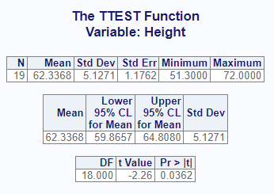
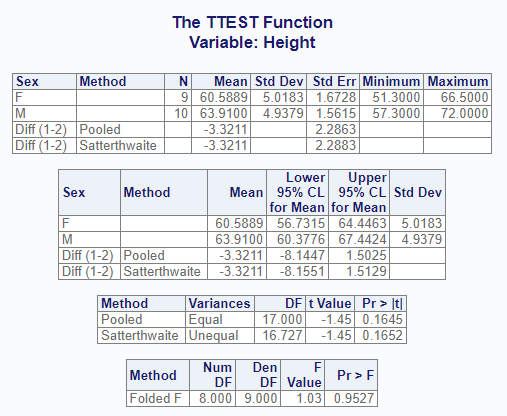
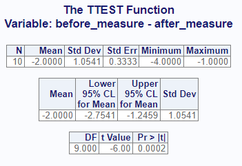
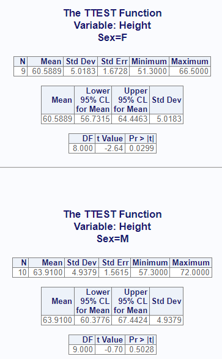

```{r setup, include = FALSE}
knitr::opts_chunk$set(
  collapse = TRUE,
  comment = "#>"
)
```
The `proc_ttest` function simulates some of the functionality of SAS® PROC TTEST.
It can compute T-Tests and confidence limits for one sample, paired samples,
and two independent samples. The function is both 
interactive and returns a list of data frames that can be used for further 
analysis or reporting.

## Create Sample Data

For the one and two sample T-Tests, we will use the following data.
This sample data is identical to the `sashelp.class` dataset:
```{r eval=FALSE, echo=TRUE} 
# Create sample data
cls <- read.table(header = TRUE, text = '
    Name Sex Age Height Weight
  Alfred   M  14   69.0  112.5
  Alice    F  13   56.5   84.0
  Barbara  F  13   65.3   98.0
  Carol    F  14   62.8  102.5
  Henry    M  14   63.5  102.5
  James    M  12   57.3   83.0
  Jane     F  12   59.8   84.5
  Janet    F  15   62.5  112.5
  Jeffrey  M  13   62.5   84.0
  John     M  12   59.0   99.5
  Joyce    F  11   51.3   50.5
  Judy     F  14   64.3   90.0
  Louise   F  12   56.3   77.0
  Mary     F  15   66.5  112.0
  Philip   M  16   72.0  150.0
  Robert   M  12   64.8  128.0
  Ronald   M  15   67.0  133.0
  Thomas   M  11   57.5   85.0
  William  M  15   66.5  112.0')

```

## One Sample T-Test
A one-sample T-Test is used to determine if the mean of the target variable is
significantly different from a baseline or null hypothesis.  To perform this test,
the target variable is passed on the `var` parameter, and the null hypothesis
is passed as an option.  Like this:
```{r eval=FALSE, echo=TRUE} 
# Turn off printing to pass CRAN checks
options("procs.print" = FALSE)

# Single sample test
res1 <- proc_ttest(cls, var = Height, options = c(h0 = 65))

# View results
res1
# $Statistics
#      VAR  N     MEAN      STD   STDERR  MIN MAX
# 1 Height 19 62.33684 5.127075 1.176232 51.3  72
# 
# $ConfLimits
#      VAR     MEAN     LCLM     UCLM      STD  LCLMSTD  UCLMSTD
# 1 Height 62.33684 59.86567 64.80801 5.127075 3.874083 7.582045
# 
# $TTests
#      VAR DF         T      PROBT
# 1 Height 18 -2.264144 0.03615222

```
Observe that the results of the function is a list of three data frames: 
"Statistics", "ConfLimits", and "TTests".  If working in RStudio and printing
is enabled, these same three result sets will be sent to the viewer:



The interactive report allows you to quickly get a snapshot of statistical 
values for your data, and can help you determine the next course of action.

## Two Sample T-Test
Now let's test two independent samples.  To test two independent samples, 
the target variable is passed on the `var` parameter as above.  But the variable
is split into two groups, as identified by the variable on the `class` parameter.
Here we will perform another analysis on "Height", and attempt to determine
if there is a significant difference between Males and Females with respect to
height:
```{r eval=FALSE, echo=TRUE} 
# Perform two-sample analysis
res2 <- proc_ttest(cls, var = Height, class = Sex)

# View results
res2
# $Statistics
#      VAR      CLASS        METHOD  N      MEAN      STD   STDERR  MIN  MAX
# 1 Height          F          <NA>  9 60.588889 5.018328 1.672776 51.3 66.5
# 2 Height          M          <NA> 10 63.910000 4.937937 1.561513 57.3 72.0
# 3 Height Diff (1-2)        Pooled NA -3.321111       NA 2.286282   NA   NA
# 4 Height Diff (1-2) Satterthwaite NA -3.321111       NA 2.288340   NA   NA
# 
# $ConfLimits
#      VAR      CLASS        METHOD      MEAN      LCLM      UCLM      STD  LCLMSTD  UCLMSTD
# 1 Height          F          <NA> 60.588889 56.731461 64.446317 5.018328 3.389665 9.613966
# 2 Height          M          <NA> 63.910000 60.377613 67.442387 4.937937 3.396487 9.014748
# 3 Height Diff (1-2)        Pooled -3.321111 -8.144744  1.502522       NA       NA       NA
# 4 Height Diff (1-2) Satterthwaite -3.321111 -8.155098  1.512875       NA       NA       NA
# 
# $TTests
#      VAR        METHOD VARIANCES       DF         T     PROBT
# 1 Height        Pooled     Equal 17.00000 -1.452625 0.1645363
# 2 Height Satterthwaite   Unequal 16.72695 -1.451319 0.1651880
# 
# $Equality
#      VAR   METHOD NDF DDF     FVAL     PROBF
# 1 Height Folded F   8   9 1.032825 0.9526904

```
The interactive output looks like this:



Notice that the output of the two independent variable T-Test is 
different than the single variable T-Test.  The two variable T-Test
provides separate descriptive statistics for the "Pooled" or "Satterthwaite"
methods, and an additional "Equality" dataset that contains the F-Value.  This
additional information can help you interpret the T-Test results correctly.


## Paired T-Test

For the paired T-Test, we will use the following data:
```{r eval=FALSE, echo=TRUE} 
# Create sample data
paird <- read.table(header = TRUE, text = '
id before after
1 12 15 
2 14 16 
3 10 11 
4 15 18 
5 18 20 
6 20 22 
7 11 12 
8 13 14 
9 16 17 
10 9 13')

```
To perform a paired T-Test, we use the `paired` parameter on the `proc_ttest()`
function, like so:
```{r eval=FALSE, echo=TRUE} 
# Perform paired analysis
res3 <- proc_ttest(paird, paired = "before * after")

# View results
res3
# $Statistics
#     VAR1  VAR2         DIFF  N MEAN      STD    STDERR MIN MAX
# 1 before after before-after 10   -2 1.054093 0.3333333  -4  -1
# 
# $ConfLimits
#     VAR1  VAR2         DIFF MEAN      LCLM      UCLM      STD  LCLMSTD  UCLMSTD
# 1 before after before-after   -2 -2.754052 -1.245948 1.054093 0.725042 1.924362
# 
# $TTests
#     VAR1  VAR2         DIFF DF  T        PROBT
# 1 before after before-after  9 -6 0.0002024993

```
Here is the interactive report:



The paired analysis is used when you have some sort of natural relationship
between the variables.  Note that the **procs** T-Test function does not support
shortcut syntax like parenthesis or hyphens like the SAS® PROC TTEST procedure.
If you want to perform the paired analysis on multiple variables, pass them
in a vector of strings.

## By Groups 

The `proc_ttest()` function provides a grouping parameter: `by`.
The `by` parameter identifies a variable or variables for subsetting the input
data. 
Here is the single sample analysis shown above, but using the `by` parameter
to perform separate tests for Males and Females:

```{r eval=FALSE, echo=TRUE} 
# By grouping
res5 <- proc_ttest(cls, var = "Height",
                   by = "Sex", options = c(h0 = 65))

# View Results
res5
# $Statistics
#   BY    VAR  N     MEAN      STD   STDERR  MIN  MAX
# 1  F Height  9 60.58889 5.018328 1.672776 51.3 66.5
# 2  M Height 10 63.91000 4.937937 1.561513 57.3 72.0
# 
# $ConfLimits
#   BY    VAR     MEAN     LCLM     UCLM      STD  LCLMSTD  UCLMSTD
# 1  F Height 60.58889 56.73146 64.44632 5.018328 3.389665 9.613966
# 2  M Height 63.91000 60.37761 67.44239 4.937937 3.396487 9.014748
# 
# $TTests
#   BY    VAR DF         T      PROBT
# 1  F Height  8 -2.637001 0.02985198
# 2  M Height  9 -0.698041 0.50278618

```
For the interactive report, the by groups will be separated onto their own page:




## Output Datasets

By default, the `proc_ttest()` function returns datasets.  Whether and what datasets
the function returns are controlled by the `output` parameter.
There are three primary options: "out", "report", and "none".  The 
"out" option is the default and returns datasets meant for further 
manipulation and analysis.
The "report" keyword requests the exact datasets used in the interactive
report.  The "none" keyword indicates that you don't want any datasets returned.
In this case, the function will return a NULL.

We can see this difference by redoing the above paired T-Test with the 
"report" output option.  
```{r eval=FALSE, echo=TRUE} 
# Output dataset using "report" option
res4 <- proc_ttest(paird, 
                   paired = "before * after",
                   output = "report")

# View results
res4
# $`diff1:Statistics`
#    N MEAN      STD    STDERR MIN MAX
# 1 10   -2 1.054093 0.3333333  -4  -1
# 
# $`diff1:ConfLimits`
#   MEAN      LCLM      UCLM      STD  LCLMSTD  UCLMSTD
# 1   -2 -2.754052 -1.245948 1.054093 0.725042 1.924362
# 
# $`diff1:TTests`
#   DF  T        PROBT
# 1  9 -6 0.0002024993

```
As can be seen in the above example, the "report" dataset contains fewer identifying
variables than the default "out" dataset. The default datasets are generally
more useful than the report datasets.  Nevertheless, there may be times
when you want to output the report datasets. For these times, the "report"
output option is conveniently available.

## Data Shaping
The "output" parameter may also be used to shape the data. There are three
shaping options: "wide", "long", and "stacked".  The default is "wide", and
contains the statistics in columns and variables in rows.  

Let's use the single variable analysis with two variables to examine
the "wide", "long" and "stacked" shaping options.  By running each option
with the same analysis, we will be able to see the differences
in the the output datasets clearly:

```{r eval=FALSE, echo=TRUE}
# Output option "wide" 
res5 <- proc_ttest(cls, var = c("Height", "Weight"),
                   options = c(h0 = 65),
                   output = "wide")

# View results
res5
# $Statistics
#      VAR  N      MEAN       STD   STDERR  MIN MAX
# 1 Height 19  62.33684  5.127075 1.176232 51.3  72
# 2 Weight 19 100.02632 22.773933 5.224699 50.5 150
# 
# $ConfLimits
#      VAR      MEAN     LCLM      UCLM       STD   LCLMSTD   UCLMSTD
# 1 Height  62.33684 59.86567  64.80801  5.127075  3.874083  7.582045
# 2 Weight 100.02632 89.04963 111.00300 22.773933 17.208272 33.678652
# 
# $TTests
#      VAR DF         T        PROBT
# 1 Height 18 -2.264144 3.615222e-02
# 2 Weight 18  6.703988 2.754086e-06

# Output option "long" 
res6 <- proc_ttest(cls, var = c("Height", "Weight"),
                   options = c(h0 = 65),
                   output = "long")

# View results
res6
# $Statistics
#     STAT    Height     Weight
# 1      N 19.000000  19.000000
# 2   MEAN 62.336842 100.026316
# 3    STD  5.127075  22.773933
# 4 STDERR  1.176232   5.224699
# 5    MIN 51.300000  50.500000
# 6    MAX 72.000000 150.000000
# 
# $ConfLimits
#      STAT    Height    Weight
# 1    MEAN 62.336842 100.02632
# 2    LCLM 59.865671  89.04963
# 3    UCLM 64.808013 111.00300
# 4     STD  5.127075  22.77393
# 5 LCLMSTD  3.874083  17.20827
# 6 UCLMSTD  7.582045  33.67865
# 
# $TTests
#    STAT      Height       Weight
# 1    DF 18.00000000 1.800000e+01
# 2     T -2.26414390 6.703988e+00
# 3 PROBT  0.03615222 2.754086e-06

# Output option "stacked" 
res7 <- proc_ttest(cls, var = c("Height", "Weight"),
                   options = c(h0 = 65),
                   output = "stacked")

# View results
res7
# $Statistics
#       VAR   STAT     VALUES
# 1  Height      N  19.000000
# 2  Height   MEAN  62.336842
# 3  Height    STD   5.127075
# 4  Height STDERR   1.176232
# 5  Height    MIN  51.300000
# 6  Height    MAX  72.000000
# 7  Weight      N  19.000000
# 8  Weight   MEAN 100.026316
# 9  Weight    STD  22.773933
# 10 Weight STDERR   5.224699
# 11 Weight    MIN  50.500000
# 12 Weight    MAX 150.000000
# 
# $ConfLimits
#       VAR    STAT     VALUES
# 1  Height    MEAN  62.336842
# 2  Height    LCLM  59.865671
# 3  Height    UCLM  64.808013
# 4  Height     STD   5.127075
# 5  Height LCLMSTD   3.874083
# 6  Height UCLMSTD   7.582045
# 7  Weight    MEAN 100.026316
# 8  Weight    LCLM  89.049631
# 9  Weight    UCLM 111.003000
# 10 Weight     STD  22.773933
# 11 Weight LCLMSTD  17.208272
# 12 Weight UCLMSTD  33.678652
# 
# $TTests
#      VAR  STAT        VALUES
# 1 Height    DF  1.800000e+01
# 2 Height     T -2.264144e+00
# 3 Height PROBT  3.615222e-02
# 4 Weight    DF  1.800000e+01
# 5 Weight     T  6.703988e+00
# 6 Weight PROBT  2.754086e-06

```


Next: [Data Manipulation](procs-dm.html)
