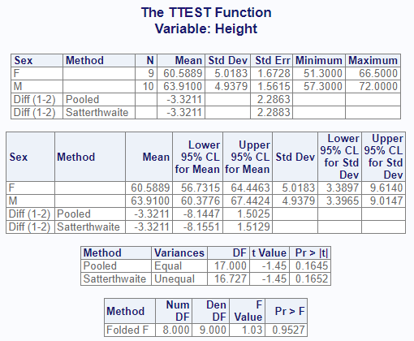
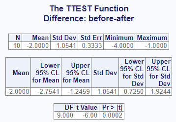
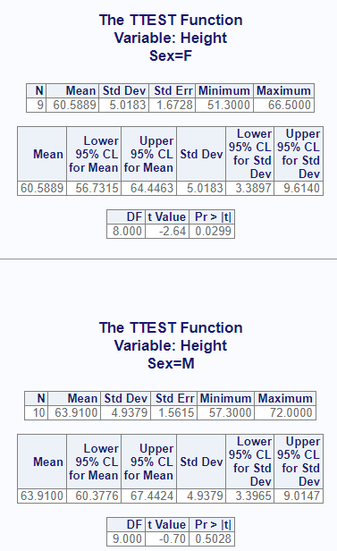

```{r setup, include = FALSE}
knitr::opts_chunk$set(
  collapse = TRUE,
  comment = "#>"
)
```
The `proc_ttest` function simulates some of the functionality of SAS® PROC TTEST.
It can compute T-Tests and confidence limits for one sample, paired samples,
and two independent samples. The function is both 
interactive and returns a list of data frames that can be used for further 
analysis or reporting.

## Create Sample Data

For the one and two sample T-Tests, we will use the following data.
This sample data is identical to the `sashelp.class` dataset:
```{r eval=FALSE, echo=TRUE} 
# Create sample data
cls <- read.table(header = TRUE, text = '
    Name Sex Age Height Weight
  Alfred   M  14   69.0  112.5
  Alice    F  13   56.5   84.0
  Barbara  F  13   65.3   98.0
  Carol    F  14   62.8  102.5
  Henry    M  14   63.5  102.5
  James    M  12   57.3   83.0
  Jane     F  12   59.8   84.5
  Janet    F  15   62.5  112.5
  Jeffrey  M  13   62.5   84.0
  John     M  12   59.0   99.5
  Joyce    F  11   51.3   50.5
  Judy     F  14   64.3   90.0
  Louise   F  12   56.3   77.0
  Mary     F  15   66.5  112.0
  Philip   M  16   72.0  150.0
  Robert   M  12   64.8  128.0
  Ronald   M  15   67.0  133.0
  Thomas   M  11   57.5   85.0
  William  M  15   66.5  112.0')

```

## One Sample T-Test
A one-sample T-Test is used to determine if the mean of the target variable is
significantly different from a baseline or null hypothesis.  To perform this test,
the target variable is passed on the `var` parameter, and the null hypothesis
is passed as an option.  Like this:
```{r eval=FALSE, echo=TRUE} 
# Turn off printing to pass CRAN checks
options("procs.print" = FALSE)

# Single sample test
res1 <- proc_ttest(cls, var = Height, options = c(h0 = 65))

# View results
res1
# $Statistics
#      VAR  N     MEAN      STD   STDERR  MIN MAX
# 1 Height 19 62.33684 5.127075 1.176232 51.3  72
# 
# $ConfLimits
#      VAR     MEAN     LCLM     UCLM      STD
# 1 Height 62.33684 59.86567 64.80801 5.127075
# 
# $TTests
#      VAR DF         T      PROBT
# 1 Height 18 -2.264144 0.03615222

```
Observe that the results of the function is a list of three data frames: 
"Statistics", "ConfLimits", and "TTests".  If working in RStudio and printing
is enabled, these same three result sets will also sent to the viewer:


The calculated p-value of 0.0362 suggests that the null hypothesis can be 
rejected, and that there is a significant difference between 65 and the mean
of "Height".

## Two Sample T-Test
Now let's test two independent samples.  To test two independent samples, 
the target variable is passed on the `var` parameter as above.  But the variable
is split into two groups, as identified by the variable on the `class` parameter.
Here we will perform another analysis on "Height", and attempt to determine
if there is a significant difference between Males and Females with respect to
height:
```{r eval=FALSE, echo=TRUE} 
# Perform two-sample analysis
res2 <- proc_ttest(cls, var = Height, class = Sex)

# View results
res2
# $Statistics
#      VAR      CLASS        METHOD  N      MEAN      STD   STDERR  MIN  MAX
# 1 Height          F          <NA>  9 60.588889 5.018328 1.672776 51.3 66.5
# 2 Height          M          <NA> 10 63.910000 4.937937 1.561513 57.3 72.0
# 3 Height Diff (1-2)        Pooled NA -3.321111       NA 2.286282   NA   NA
# 4 Height Diff (1-2) Satterthwaite NA -3.321111       NA 2.288340   NA   NA
# 
# $ConfLimits
#      VAR      CLASS        METHOD      MEAN      LCLM      UCLM      STD
# 1 Height          F          <NA> 60.588889 56.731461 64.446317 5.018328
# 2 Height          M          <NA> 63.910000 60.377613 67.442387 4.937937
# 3 Height Diff (1-2)        Pooled -3.321111 -8.144744  1.502522       NA
# 4 Height Diff (1-2) Satterthwaite -3.321111 -8.155098  1.512875       NA
# 
# $TTests
#      VAR        METHOD VARIANCES       DF         T     PROBT
# 1 Height        Pooled     Equal 17.00000 -1.452625 0.1645363
# 2 Height Satterthwaite   Unequal 16.72695 -1.451319 0.1651880
# 
# $Equality
#      VAR   METHOD NDF DDF     FVAL     PROBF
# 1 Height Folded F   8   9 1.032825 0.9526904

```
The interactive output looks like this:



The T-Test reveals that there is no significant difference in the mean height
between males and females in the sample data provided.

## Paired T-Test

For the paired T-Test, we will use the following data:
```{r eval=FALSE, echo=TRUE} 
# Create sample data
paird <- read.table(header = TRUE, text = '
subject_id before_measure after_measure region
1 12 15  A
2 14 16  A
3 10 11  A
4 15 18  A
5 18 20  A
6 20 22  B
7 11 12  B
8 13 14  B
9 16 17  B
10 9 13  B')

```
To perform a paired T-Test, we use the `paired` parameter on the `proc_ttest()`
function, like so:
```{r eval=FALSE, echo=TRUE} 
# Perform paired analysis
res3 <- proc_ttest(paird, paired = "before_measure * after_measure")

# View results
res3
# $Statistics
#      VAR  N MEAN      STD    STDERR MIN MAX
# 1 ..diff 10   -2 1.054093 0.3333333  -4  -1
# 
# $ConfLimits
#      VAR MEAN      LCLM      UCLM      STD
# 1 ..diff   -2 -2.754052 -1.245948 1.054093
# 
# $TTests
#      VAR DF  T        PROBT
# 1 ..diff  9 -6 0.0002024993

```
Here is the interactive report:



## Output Datasets

By default, the `proc_ttest()` function returns datasets.  Whether and what datasets
the function returns are controlled by the `output` parameter.
There are three primary options: "out", "report", and "none".  The 
"out" option is the default and returns datasets meant for further 
manipulation and analysis.
The "report" keyword requests the exact datasets used in the interactive
report.  The "none" keyword indicates that you don't want any datasets returned.
In this case, the function will return a NULL.

Here is an example that shows the difference in the "report" and "out" options:
```{r eval=FALSE, echo=TRUE} 
# Output dataset using "report" option
res1 <- proc_means(dat, 
                   stats = v(median, sum, q1, q3),
                   output = report)

# View results
res1
#   VAR MEDIAN SUM   Q1   Q3
# 1   x      3  29  2.0  5.5
# 2   z     65 506 57.5 75.5


# Output dataset using "all" option
res2 <- proc_means(dat, 
                   stats = v(median, sum, q1, q3),
                   output = out)

# View results
res2
#   TYPE FREQ VAR MEDIAN SUM   Q1   Q3
# 1    0    8   x      3  29  2.0  5.5
# 2    0    8   z     65 506 57.5 75.5

```
As can be seen in the above example, the "out" dataset includes additional
variables for TYPE and FREQ. These additional variables can be 
turned off with options:
```{r eval=FALSE, echo=TRUE} 

# Turn off TYPE and FREQ variables
res3 <- proc_means(dat, 
                   stats = v(median, sum, q1, q3),
                   output = all,
                   options = v(notype, nofreq))

# View results
res3
#   VAR MEDIAN SUM   Q1   Q3
# 1   x      3  29  2.0  5.5
# 2   z     65 506 57.5 75.5
```

## By Groups 

The `proc_ttest` function provides a grouping parameter: `by`.
The `by` parameter identifies a variable or variables for subsetting the input
data.  
Here is the single sample analysis shown above, but using the `by` parameter
to perform separate tests for Males and Females:

```{r eval=FALSE, echo=TRUE} 
# By grouping
res4 <- proc_ttest(cls, var = Height,
                   by = Sex, options = c(h0 = 65))

# View Results
res4
# $Statistics
#   BY    VAR  N     MEAN      STD   STDERR  MIN  MAX
# 1  F Height  9 60.58889 5.018328 1.672776 51.3 66.5
# 2  M Height 10 63.91000 4.937937 1.561513 57.3 72.0
# 
# $ConfLimits
#   BY    VAR     MEAN     LCLM     UCLM      STD
# 1  F Height 60.58889 56.73146 64.44632 5.018328
# 2  M Height 63.91000 60.37761 67.44239 4.937937
# 
# $TTests
#   BY    VAR DF         T      PROBT
# 1  F Height  8 -2.637001 0.02985198
# 2  M Height  9 -0.698041 0.50278618

```
For the interactive report, the by groups will be separated onto their own page:




Next: [Data Manipulation](procs-dm.html)
