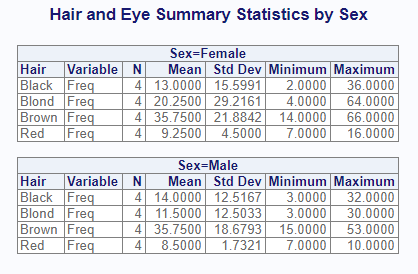
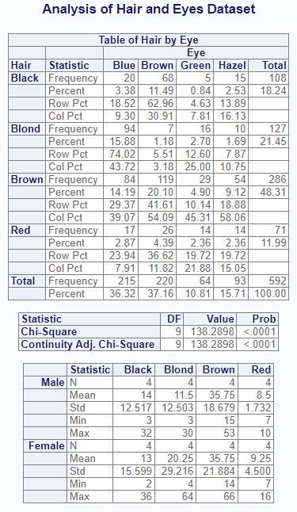

```{r, include = FALSE}
knitr::opts_chunk$set(
  collapse = TRUE,
  comment = "#>"
)
```

The **procs** package contains functions that replicate procedures from
SAS® software. The intention of the package is to ease transition to R
adoption by providing SAS® programmers a familiar conceptual framework and 
functions that produce nearly identical output. Along the way, the 
functions in the **procs** package also provide much nicer output 
than many R statistical functions.

## Key Functions

The package includes the following functions:

* `proc_freq()`: A function to simulate the FREQ procedure.
* `proc_means()`: A function to simulate the MEANS or SUMMARY procedure.
* `proc_transpose()`: A function to pivot data similar in syntax to the 
TRANSPOSE procedure.
* `proc_sort()`: A function to sort and dedupe datasets.
* `proc_print()`: A quick-print function to send procedure results to the viewer
or a report.


## How to Use

### Frequency Statistics

The `proc_freq()` function generates frequency statistics in a manner
similar to SAS® PROC FREQ. You can request one-way and two-way frequency
tables using the `tables` parameter.  Frequencies may be weighted using 
the `weight` parameter.  Simply pass the name of the variable that contains
the weighted values.  There are many
options to control the output data and display.  

Note that the `options("procs.print" = FALSE)` global option
has been added to these examples to allow the **procs** package to pass
CRAN checks.  When running sample code yourself,
remove this option or set to TRUE.

```{r eval=FALSE, echo=TRUE} 
library(procs)

# Turn off printing for CRAN checks
options("procs.print" = FALSE)

# Prepare sample data
dt <- as.data.frame(HairEyeColor, stringsAsFactors = FALSE)

# Assign labels
labels(dt) <- list(Hair = "Hair Color",
                   Eye = "Eye Color")

# Produce frequency statistics
res <- proc_freq(dt, tables = v(Hair, Eye, Hair * Eye),
                 weight = Freq,
                 output = report,
                 options = chisq,
                 titles = "Hair and Eye Frequency Statistics")

```
When printing is allowed, the `proc_freq` function will display the 
following report in the viewer:  


The function call requested output datasets using the "report" option. If 
there is more than one output dataset, they will be returned in a list.
The output dataset list can be seen below:
```{r eval=FALSE, echo = TRUE}
# View output datasets
res
# $Hair
#     CAT   N CNT      PCT CUMSUM    CUMPCT
# 1 Black 592 108 18.24324    108  18.24324
# 2 Blond 592 127 21.45270    235  39.69595
# 3 Brown 592 286 48.31081    521  88.00676
# 4   Red 592  71 11.99324    592 100.00000
# 
# $Eye
#     CAT   N CNT      PCT CUMSUM    CUMPCT
# 1  Blue 592 215 36.31757    215  36.31757
# 2 Brown 592 220 37.16216    435  73.47973
# 3 Green 592  64 10.81081    499  84.29054
# 4 Hazel 592  93 15.70946    592 100.00000
# 
# $`Hair * Eye`
#      CAT Statistic       Blue      Brown      Green     Hazel     Total
# 1  Black Frequency  20.000000  68.000000  5.0000000 15.000000 108.00000
# 2  Black   Percent   3.378378  11.486486  0.8445946  2.533784  18.24324
# 3  Black   Row Pct  18.518519  62.962963  4.6296296 13.888889        NA
# 4  Black   Col Pct   9.302326  30.909091  7.8125000 16.129032        NA
# 5  Blond Frequency  94.000000   7.000000 16.0000000 10.000000 127.00000
# 6  Blond   Percent  15.878378   1.182432  2.7027027  1.689189  21.45270
# 7  Blond   Row Pct  74.015748   5.511811 12.5984252  7.874016        NA
# 8  Blond   Col Pct  43.720930   3.181818 25.0000000 10.752688        NA
# 9  Brown Frequency  84.000000 119.000000 29.0000000 54.000000 286.00000
# 10 Brown   Percent  14.189189  20.101351  4.8986486  9.121622  48.31081
# 11 Brown   Row Pct  29.370629  41.608392 10.1398601 18.881119        NA
# 12 Brown   Col Pct  39.069767  54.090909 45.3125000 58.064516        NA
# 13   Red Frequency  17.000000  26.000000 14.0000000 14.000000  71.00000
# 14   Red   Percent   2.871622   4.391892  2.3648649  2.364865  11.99324
# 15   Red   Row Pct  23.943662  36.619718 19.7183099 19.718310        NA
# 16   Red   Col Pct   7.906977  11.818182 21.8750000 15.053763        NA
# 17 Total Frequency 215.000000 220.000000 64.0000000 93.000000 592.00000
# 18 Total   Percent  36.317568  37.162162 10.8108108 15.709459 100.00000
# 
# $Chisq
#      Measure        Value
# 1 Chi-Square 1.382898e+02
# 2         DF 9.000000e+00
# 3   PR>ChiSq 2.325287e-25

```

### Summary Statistics

The `proc_means()` function calculates summary statistics, similar to 
the SAS® PROC MEANS procedure.  The variable or variables to generate 
statistics for is passed on the `var` parameter.  The `class` parameter
tells the function to group results by the indicated variable.  The 
`by` parameter will subset the data according to the distinct by 
values.  Note that any class groupings are nested in the by.  

```{r eval=FALSE, echo=TRUE} 
# Perform calculations
res2 <- proc_means(dt, var = Freq, 
                   class = Hair,
                   by = Sex,
                   titles = "Hair and Eye Summary Statistics by Sex")

```

The following is sent to the viewer:



And here is the output dataset.  Observe that the output dataset
is not identical to the displayed report.  The output dataset has
been optimized for data manipulation, while the displayed
report has been optimized for viewing:

```{r eval=FALSE, echo = TRUE}
# View the summary statistics
res2
#        BY CLASS TYPE FREQ  VAR  N    MEAN       STD MIN MAX
# 1  Female  <NA>    0   16 Freq 16 19.5625 20.713824   2  66
# 2  Female Black    1    4 Freq  4 13.0000 15.599145   2  36
# 3  Female Blond    1    4 Freq  4 20.2500 29.216149   4  64
# 4  Female Brown    1    4 Freq  4 35.7500 21.884165  14  66
# 5  Female   Red    1    4 Freq  4  9.2500  4.500000   7  16
# 6    Male  <NA>    0   16 Freq 16 17.4375 16.008201   3  53
# 7    Male Black    1    4 Freq  4 14.0000 12.516656   3  32
# 8    Male Blond    1    4 Freq  4 11.5000 12.503333   3  30
# 9    Male Brown    1    4 Freq  4 35.7500 18.679311  15  53
# 10   Male   Red    1    4 Freq  4  8.5000  1.732051   7  10
```
Notice that the output data contains breakouts by class and summaries
by group.  The summaries by group are identifed by rows where TYPE = 0.
The breakouts by class are TYPE = 1.  In other words, rows 1 and 6 
provide summary statistics for the by groups FEMALE and MALE, while the other
rows provide statistics for each class category.

Also note that both `proc_freq()` 
and `proc_means()` follow the convention of naming
columns according to the statistic or parameter they represent.  This convention
is somewhat different from SAS®, but makes it easier to manipulate
the output datasets.


### Other Functions

While the main focus of the **procs** package is on statistical
procedures, the output from these procedures is often manipulated to
produce a more desirable result. Some additional functions have been added
to the **procs** package that SAS® programmers will be familiar with:
`proc_transpose()`, `proc_sort()`, and `proc_print()`.

Continuing from the example above, let's take some additional steps
to produce a little report:

```{r eval=FALSE, echo=TRUE} 
library(fmtr)

# Filter and select using subset function
res3 <- subset(res2, TYPE != 0, c(BY, CLASS, N, MEAN, STD, MIN, MAX))

# Transpose statistics 
res4 <- proc_transpose(res3, id = CLASS, by = BY, name = Statistic)

# View transformed data
res4
#        BY Statistic    Black    Blond    Brown       Red
# 1  Female         N  4.00000  4.00000  4.00000  4.000000
# 2  Female      MEAN 13.00000 20.25000 35.75000  9.250000
# 3  Female       STD 15.59915 29.21615 21.88416  4.500000
# 4  Female       MIN  2.00000  4.00000 14.00000  7.000000
# 5  Female       MAX 36.00000 64.00000 66.00000 16.000000
# 6    Male         N  4.00000  4.00000  4.00000  4.000000
# 7    Male      MEAN 14.00000 11.50000 35.75000  8.500000
# 8    Male       STD 12.51666 12.50333 18.67931  1.732051
# 9    Male       MIN  3.00000  3.00000 15.00000  7.000000
# 10   Male       MAX 32.00000 30.00000 53.00000 10.000000

# Assign factor to BY so we can sort
res4$BY <- factor(res4$BY, levels = c("Male", "Female"))

# Sort male to top
res5 <- proc_sort(res4, by = BY)
#        BY Statistic    Black    Blond    Brown       Red
# 6    Male         N  4.00000  4.00000  4.00000  4.000000
# 7    Male      MEAN 14.00000 11.50000 35.75000  8.500000
# 8    Male       STD 12.51666 12.50333 18.67931  1.732051
# 9    Male       MIN  3.00000  3.00000 15.00000  7.000000
# 10   Male       MAX 32.00000 30.00000 53.00000 10.000000
# 1  Female         N  4.00000  4.00000  4.00000  4.000000
# 2  Female      MEAN 13.00000 20.25000 35.75000  9.250000
# 3  Female       STD 15.59915 29.21615 21.88416  4.500000
# 4  Female       MIN  2.00000  4.00000 14.00000  7.000000
# 5  Female       MAX 36.00000 64.00000 66.00000 16.000000

# Create formatting list
fmt <- flist(STD = "%.3f", type = "row", lookup = res5$Statistic)

# Create vector lookup
vf <- c(MEAN = "Mean", STD = "Std", MEDIAN = "Median", 
        MIN = "Min", MAX = "Max")

# Assign formats 
formats(res5) <- list(Statistic = vf,
                      Black = fmt,
                      Blond = fmt,
                      Brown = fmt,
                      Red = fmt)

# Reassign first column name
names(res5)[1] <- "stub"

# Assign labels
labels(res5) <- list(stub = "Sex")

# Create list for reporting
prnt <- list(res$`Hair * Eye`, res$Chisq, res5)

# Print result
proc_print(prnt, 
           titles = "Analysis of Hair and Eyes Dataset",
           view = FALSE) # Set view = TRUE to see results

```


If desired, we could print this report to the file system using 
the `file_path` and `output_type` parameters on `proc_print()`.

## Next Steps

For next steps, please review the examples provided in the vignette articles. 
Those articles include:

* [The Frequency Function](procs-freq.html)
* [The Means Function](procs-means.html)
* [Data Manipulation Functions](procs-dm.html)
* [Example 1: Demographics](procs-example1.html)
* [Example 2: Adverse Events](procs-example2.html)


