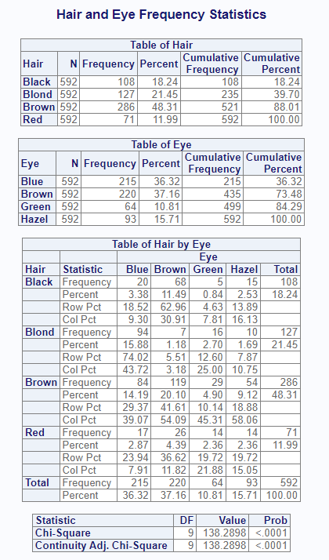

```{r, include = FALSE}
knitr::opts_chunk$set(
  collapse = TRUE,
  comment = "#>"
)
```

The **procs** package contains functions that replicate procedures from
SAS® software. The intention of the package is to ease transition to R
adoption by providing SAS® programmers a familiar conceptual framework and 
functions that produce nearly identical output. Along the way, the 
functions in the **procs** package also provide much nicer output 
than existing R statistical functions.

### Key Functions

The package includes the following major functions:

* `proc_freq()`: A function to simulate the FREQ procedure.
* `proc_means()`: A function to simulate the MEANS or SUMMARY procedure.
* `proc_transpose()`: A function to pivot data similar in syntax to the 
TRANSPOSE procedure.
* `proc_sort()`: A function to sort and dedupe datasets.
* `proc_compare()`: A function to compare two datasets and report on 
the differences between them.


### How to Use


The following examples illustrate the basic functionality of each of the 
above three functions:

#### The `proc_freq()` Function

The `proc_freq()` function generates frequency statistics in a manner
similar to SAS® PROC FREQ.  

```{r eval=FALSE, echo=TRUE} 
library(procs)
library(fmtr)

dt <- as.data.frame(HairEyeColor, stringsAsFactors = FALSE)

labels(dt) <- list(Hair = "Hair Color",
                   Eye = "Eye Color")

res <- proc_freq(dt, tables = c("Hair", "Eye", "Hair * Eye"),
                 weight = "Freq",
                 titles = "Hair and Eye Frequency Statistics")

```
By default, the following report will be shown in the viewer:


Also note that the `proc_freq()` function returned a list of data frames
in the variable 'res'.  This variable contains the 
results of the analysis, and the data values within these data frames are
un-rounded.  This data can be used in additional analysis or for custom reporting.

#### The `proc_means()` Function

The `proc_means()` function attempts to provide similar functionality to 
the SAS® PROC MEANS procedure.

The below example takes the Hair frequencies calculated above and performs
some summary statistics on the frequencies using `proc_means()`:

```{r eval=FALSE, echo=TRUE} 
library(procs)

# Get Hair frequencies
dt <- res$Hair

# Perform calculations
res2 <- proc_means(dt, var = "Frequency", 
                   stats = c("n", "mean", "std", "min", "max"))

# View the summary statistics
res2
# [[1]]
# # A tibble: 1 × 6
#   Variable      N  Mean Std_Dev Minimum Maximum
#   <chr>     <int> <dbl>   <dbl>   <dbl>   <dbl>
# 1 Frequency     4   148    94.9      71     286
```

#### The `proc_transpose()` Function

While the main purpose of the **procs** package is to replicate SAS® statistical
procedures, the output from these procedures is often manipulated to
produce a more desirable result.  While R and Tidyverse do contain sufficient
data manipulation functions, the TRANSPOSE procedure from SAS® provides a 
somewhat different conceptual model that SAS® programmers like.  The aim
of the `proc_transpose()` function is to offer a similar model in R.

The following example takes the "Hair" frequencies from the `proc_freq()`
example above, and transposes the rows and columns:

```{r eval=FALSE, echo=TRUE} 
library(procs)

# Get Hair frequencies
dt <- res$Hair

# View Hair frequencies
dt
# # A tibble: 4 × 5
#   Category Frequency Percent Cum_Freq Cum_Pct
#   <chr>        <dbl>   <dbl>    <dbl>   <dbl>
# 1 Black          108    18.2      108    18.2
# 2 Blond          127    21.5      235    39.7
# 3 Brown          286    48.3      521    88.0
# 4 Red             71    12.0      592   100 

res3 <- proc_transpose(dt, var = c("Frequency", "Percent", "Cum_Freq", "Cum_Pct"),
                       id = "Category", name = "Statistic")

# View transformed data
res3
# # A tibble: 4 × 5
#   Statistic Black Blond Brown   Red
#   <chr>     <dbl> <dbl> <dbl> <dbl>
# 1 Frequency 108   127   286    71  
# 2 Percent    18.2  21.5  48.3  12.0
# 3 Cum_Freq  108   235   521   592  
# 4 Cum_Pct    18.2  39.7  88.0 100  
```

#### The `proc_sort()` Function


#### The `proc_compare()` Function


### Next Steps

For next steps, please review the examples provided in the vignette articles. 
Those articles include:

* [The Frequency Function](procs-freq.html)
* [The Means Function](procs-means.html)
* [The Transpose Function](procs-transpose.html)
* [The Sort Function](procs-sort.html)
* [The Compare Function](procs-compare.html)
* [Package Validation](procs-validation.html)
* [Complete Example](procs-example1.html)


